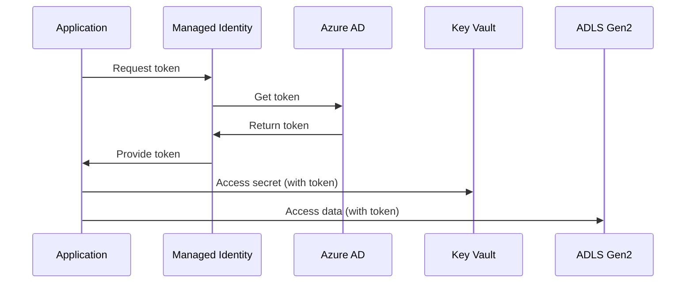

# Architecture Guidelines - Default

## 🏗️ Principes d'Architecture

### 1. Well-Architected Framework

Tous les projets doivent suivre les 5 piliers:

**Reliability** (Fiabilité):
- Haute disponibilité (99.9% minimum)
- Disaster recovery planifié
- Retry logic avec exponential backoff
- Health checks et auto-healing

**Security** (Sécurité):
- Defense in depth
- Least privilege (RBAC)
- Zero trust
- Managed Identity partout
- Key Vault pour secrets
- Network isolation

**Cost Optimization** (Optimisation Coûts):
- Right-sizing des ressources
- Reserved instances pour workloads prévisibles
- Auto-scaling
- Monitoring des coûts
- Tags pour allocation

**Operational Excellence** (Excellence Opérationnelle):
- Infrastructure as Code (Terraform)
- CI/CD automatisé
- Monitoring et alerting
- Documentation à jour
- Incident response plan

**Performance Efficiency** (Performance):
- Caching stratégique
- Partitioning efficace
- Indexing approprié
- Auto-scaling
- Load testing

### 2. Data Architecture Patterns

#### Medallion Architecture (Recommandé)

```
Bronze (Raw) → Silver (Cleaned) → Gold (Curated)
```

**Bronze Layer**:
- Données brutes, non transformées
- Format source préservé
- Append-only (historique complet)
- Retention: 90 jours

**Silver Layer**:
- Données nettoyées et validées
- Format standardisé (Parquet/Delta)
- Dédupliquées
- Retention: 2 ans

**Gold Layer**:
- Données agrégées et prêtes à l'emploi
- Optimisées pour analytics
- Modèle dimensional si applicable
- Retention: 5+ ans

#### Lambda Architecture (Stream + Batch)

Pour les cas nécessitant temps réel + batch:

```
Sources → Event Hubs → Stream Analytics → Hot Path (temps réel)
       → Batch Ingestion → ADF/Databricks → Cold Path (batch)
       → Serving Layer → Unified View
```

### 3. Security Architecture

#### Defense in Depth

```
┌─────────────────────────────────────┐
│ External Access                     │
│ ├─ Azure Front Door / API Gateway  │
│ └─ WAF + DDoS Protection           │
└─────────────────────────────────────┘
           ↓
┌─────────────────────────────────────┐
│ Network Layer                       │
│ ├─ VNet with Subnets                │
│ ├─ Private Endpoints                │
│ ├─ NSG Rules                        │
│ └─ Azure Firewall                   │
└─────────────────────────────────────┘
           ↓
┌─────────────────────────────────────┐
│ Identity & Access                   │
│ ├─ Managed Identity                 │
│ ├─ RBAC (Least Privilege)           │
│ ├─ PIM (Just-in-Time)               │
│ └─ Conditional Access                │
└─────────────────────────────────────┘
           ↓
┌─────────────────────────────────────┐
│ Data Protection                     │
│ ├─ Encryption at Rest               │
│ ├─ Encryption in Transit            │
│ ├─ Key Vault                        │
│ └─ Data Masking / RLS               │
└─────────────────────────────────────┘
           ↓
┌─────────────────────────────────────┐
│ Monitoring & Audit                  │
│ ├─ Azure Sentinel (SIEM)            │
│ ├─ Log Analytics                    │
│ ├─ Azure Monitor                    │
│ └─ Audit Logs                       │
└─────────────────────────────────────┘
```

#### Managed Identity Flow



### 4. Networking Architecture

#### Hub-Spoke Topology

```
Hub VNet (Shared Services)
├── Azure Firewall
├── VPN Gateway
├── Bastion
└── Monitoring
    ↓
Spoke VNet 1 (Data Platform)
├── Data Factory Subnet
├── Databricks Subnet
├── Storage Subnet (Private Endpoints)
└── Compute Subnet

Spoke VNet 2 (Applications)
├── App Services Subnet
├── Functions Subnet
└── API Management Subnet
```

### 5. Monitoring & Observability

#### Piliers de l'Observabilité

**Logs**:
- Structured JSON logging
- CorrelationId pour traçabilité
- Centralisés dans Log Analytics
- Retention: 90 jours

**Metrics**:
- Azure Monitor Metrics
- Custom metrics via App Insights
- Dashboards temps réel
- Alerting proactif

**Traces**:
- Distributed tracing (App Insights)
- End-to-end transaction tracking
- Performance profiling

**Alerting**:
- Action Groups configurés
- Escalation policies
- Integration avec Teams/Email/SMS

### 6. CI/CD Architecture

```
┌─────────────────────┐
│ Source Control      │
│ (GitHub/Azure DevOps│
└──────────┬──────────┘
           │
           ↓
┌─────────────────────┐
│ CI Pipeline         │
│ ├─ Build            │
│ ├─ Unit Tests       │
│ ├─ Code Analysis    │
│ ├─ Security Scan    │
│ └─ Artifact Publish │
└──────────┬──────────┘
           │
           ↓
┌─────────────────────┐
│ CD Pipeline         │
│ ├─ Dev (auto)       │
│ ├─ Staging (auto)   │
│ └─ Prod (approval)  │
└──────────┬──────────┘
           │
           ↓
┌─────────────────────┐
│ Post-Deployment     │
│ ├─ Health Checks    │
│ ├─ Smoke Tests      │
│ ├─ Monitoring       │
│ └─ Rollback (if fail│
└─────────────────────┘
```

## 🎯 Design Decisions

### Quand utiliser quoi?

#### Compute

| Service | Use Case |
|---------|----------|
| Data Factory | Orchestration ETL, Copy data |
| Databricks | Spark processing, ML |
| Synapse Spark | Analytics intégré, DWH |
| Azure Functions | Event-driven, serverless |
| Container Apps | Microservices, API |

#### Storage

| Service | Use Case |
|---------|----------|
| ADLS Gen2 | Data Lake, Big Data |
| Blob Storage | Objects, archives |
| Azure Files | Shared files |
| SQL Database | Relational, OLTP |
| Cosmos DB | NoSQL, global distribution |
| Synapse SQL | Data warehouse, OLAP |

#### Messaging

| Service | Use Case |
|---------|----------|
| Event Hubs | High-throughput streaming |
| Service Bus | Enterprise messaging |
| Event Grid | Event-driven, pub/sub |
| Storage Queue | Simple queue, async processing |

## 📋 Architecture Review Checklist

Avant de valider une architecture:

- [ ] **Reliability**: SLA défini, DR plan, retry logic
- [ ] **Security**: Managed Identity, Key Vault, Private Endpoints
- [ ] **Cost**: Estimation fournie, right-sizing, tags
- [ ] **Operations**: IaC (Terraform), CI/CD, monitoring
- [ ] **Performance**: Load testing plan, scaling strategy
- [ ] **Compliance**: GDPR, audit logs, data retention
- [ ] **Documentation**: TAD complet, ADRs, diagrams
- [ ] **Testing**: Unit, integration, E2E, load tests

## 📚 Références

- [Azure Architecture Center](https://learn.microsoft.com/azure/architecture/)
- [Well-Architected Framework](https://learn.microsoft.com/azure/well-architected/)
- [Cloud Design Patterns](https://learn.microsoft.com/azure/architecture/patterns/)
- [Azure CAF](https://learn.microsoft.com/azure/cloud-adoption-framework/)

---

**Version**: 1.0.0  
**Dernière mise à jour**: 2026-02-03
