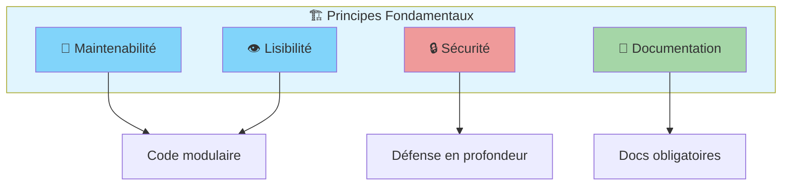
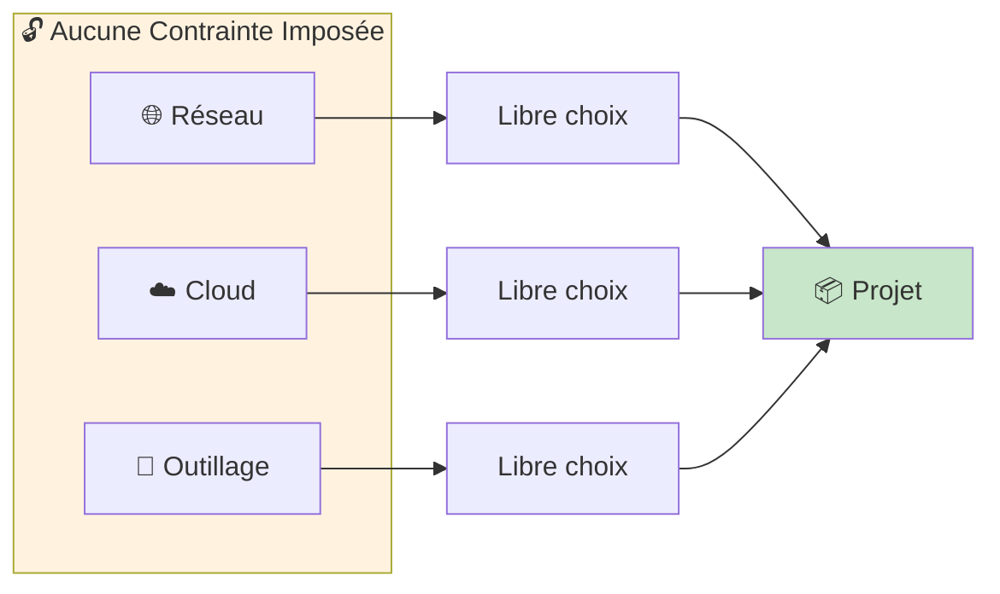
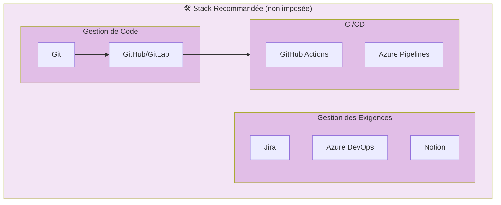
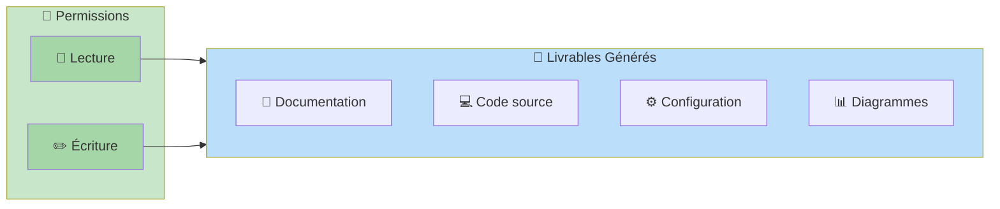

# Conventions générales

- Architecture orientée maintenabilité et lisibilité
- Sécurité par défaut
- Documentation obligatoire

## Schéma : Principes d'architecture

# Contraintes

- Aucune contrainte réseau imposée
- Aucune plateforme cloud imposée
- Aucun outil imposé

## Schéma : Flexibilité des contraintes

# Outillage

- Gestion de code : non imposée
- Gestion des exigences : non imposée

## Schéma : Stack technique recommandée

# Autorisations

- Lecture/écriture autorisées sur les livrables générés

## Schéma : Matrice des permissions

# Diagrammes Draw.io

Pour des diagrammes plus complexes, utilisez les fichiers `.drawio` suivants :

| Diagramme | Description | Fichier |
|-----------|-------------|---------|
| Architecture globale | Vue d'ensemble du système | `diagrams/architecture.drawio` |
| Flux de données | Circulation des données | `diagrams/dataflow.drawio` |
| Déploiement | Infrastructure cible | `diagrams/deployment.drawio` |

> 💡 **Note** : Les fichiers `.drawio` peuvent être édités directement dans VS Code avec l'extension [Draw.io Integration](https://marketplace.visualstudio.com/items?itemName=hediet.vscode-drawio)
