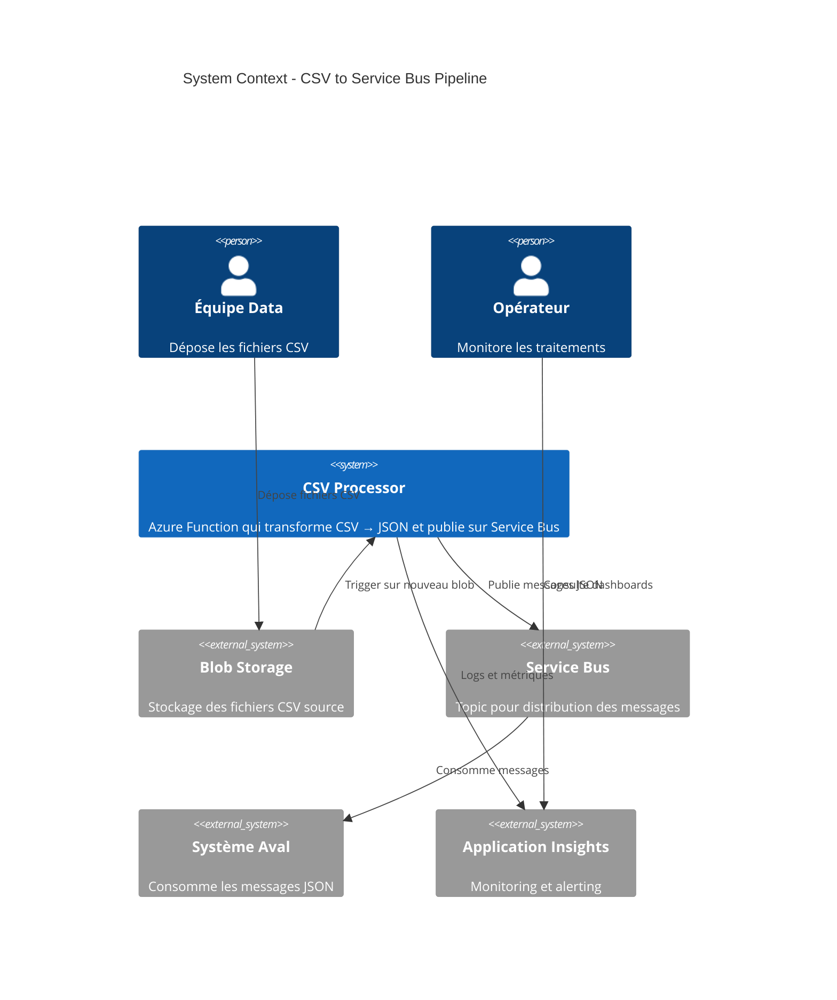
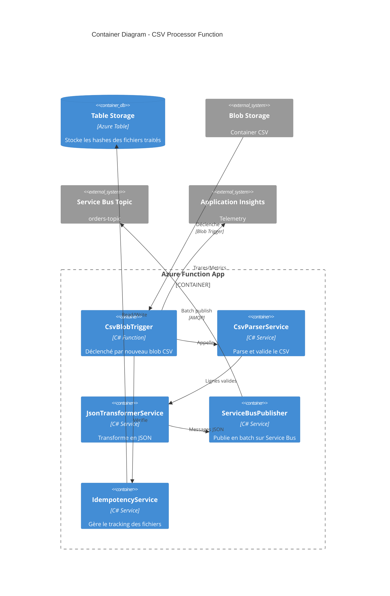
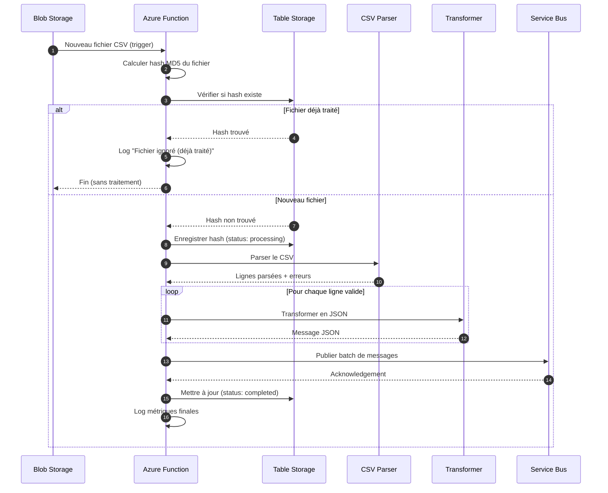
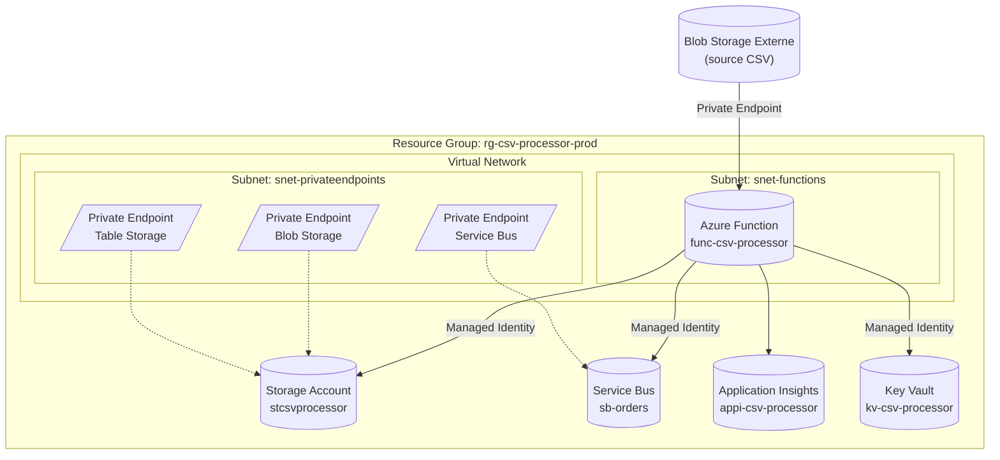
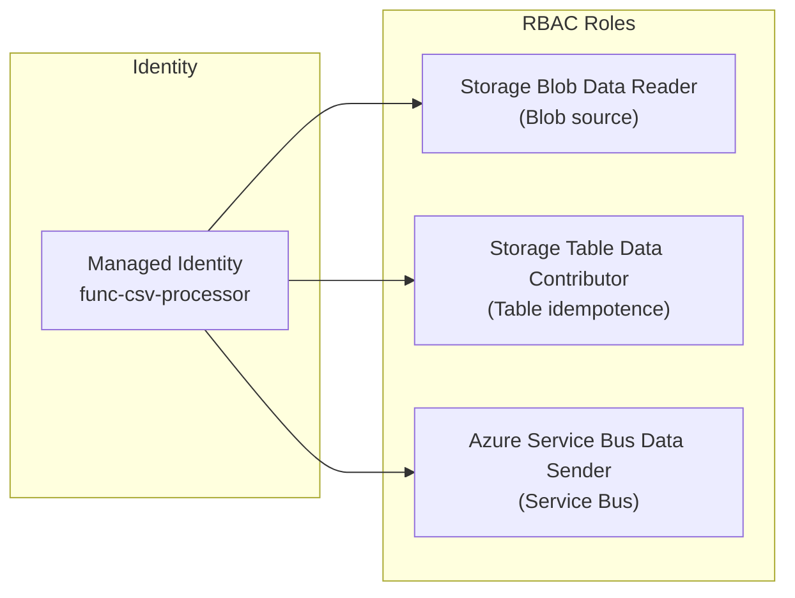

# Technical Architecture Document (TAD)

## Projet : Azure Function – Transformation CSV vers Service Bus

---

## 1. Vue d'Ensemble

### 1.1 Résumé de l'Architecture

Cette solution implémente un pipeline event-driven serverless utilisant Azure Functions pour traiter automatiquement des fichiers CSV déposés dans Blob Storage, les transformer en messages JSON et les publier sur Service Bus.

### 1.2 Principes Directeurs

| Principe | Application |
|----------|-------------|
| **Serverless-first** | Azure Functions Consumption pour optimiser les coûts |
| **Event-driven** | Blob Trigger pour déclenchement automatique |
| **Zero-trust** | Managed Identity, Private Endpoints |
| **Idempotent** | Table Storage pour tracking des fichiers traités |
| **Observable** | Application Insights pour monitoring bout-en-bout |

### 1.3 Mapping Exigences → Architecture

| Exigence | Composant Architectural |
|----------|------------------------|
| FR-001 (Déclenchement) | Blob Trigger sur Azure Function |
| FR-002 (Parsing CSV) | CsvHelper library (.NET) |
| FR-003 (Validation) | FluentValidation + Data Annotations |
| FR-004 (Transformation) | System.Text.Json mapping |
| FR-005 (Publication) | Azure.Messaging.ServiceBus SDK |
| FR-006 (Idempotence) | Azure Table Storage (hash fichier) |
| FR-007 (Logging) | Application Insights + ILogger |
| NFR-004 (Sécurité) | Managed Identity + Private Endpoints |

---

## 2. Diagrammes

### 2.1 Diagramme de Contexte (C4 Level 1)



### 2.2 Diagramme de Containers (C4 Level 2)



### 2.3 Diagramme de Séquence



### 2.4 Diagramme d'Infrastructure Azure



---

## 3. Services Azure Sélectionnés

### 3.1 Tableau des Services

| Service | SKU | Justification | Coût Estimé |
|---------|-----|---------------|-------------|
| **Azure Functions** | Consumption (Y1) | Volumétrie faible (50 fichiers/jour), coûts optimisés | ~5 €/mois |
| **Storage Account** | Standard LRS | Table Storage pour idempotence + logs Function | ~2 €/mois |
| **Application Insights** | Pay-as-you-go | Monitoring, traces distribuées | ~3 €/mois |
| **Key Vault** | Standard | Optionnel si secrets nécessaires | ~1 €/mois |
| **Private Endpoints** | - | Connexion sécurisée vers Blob/Service Bus existants | ~7 €/mois |

**Total estimé : ~18 €/mois**

### 3.2 Ressources Existantes (Out of Scope)

| Ressource | Propriétaire | Interaction |
|-----------|--------------|-------------|
| Blob Storage (source CSV) | Équipe Data | Lecture via Private Endpoint |
| Service Bus Topic | Équipe Backend | Écriture via Private Endpoint |

---

## 4. Modèle de Données

### 4.1 Schéma CSV Entrée (exemple)

```csv
OrderId;CustomerEmail;ProductCode;Quantity;UnitPrice;OrderDate
ORD-001;client@example.com;PROD-A;5;29.99;2026-02-05
ORD-002;autre@example.com;PROD-B;2;49.99;2026-02-05
```

### 4.2 Schéma JSON Sortie

```json
{
  "$schema": "http://json-schema.org/draft-07/schema#",
  "type": "object",
  "required": ["orderId", "customerEmail", "productCode", "quantity", "unitPrice", "orderDate", "metadata"],
  "properties": {
    "orderId": { "type": "string", "pattern": "^ORD-[0-9]+$" },
    "customerEmail": { "type": "string", "format": "email" },
    "productCode": { "type": "string" },
    "quantity": { "type": "integer", "minimum": 1 },
    "unitPrice": { "type": "number", "minimum": 0 },
    "orderDate": { "type": "string", "format": "date" },
    "metadata": {
      "type": "object",
      "properties": {
        "correlationId": { "type": "string", "format": "uuid" },
        "sourceFile": { "type": "string" },
        "processedAt": { "type": "string", "format": "date-time" },
        "lineNumber": { "type": "integer" }
      }
    }
  }
}
```

### 4.3 Table Storage - Idempotence

| PartitionKey | RowKey | Status | ProcessedAt | LinesCount | ErrorsCount |
|--------------|--------|--------|-------------|------------|-------------|
| 2026-02 | {MD5-hash} | completed | 2026-02-05T10:30:00Z | 4500 | 12 |

---

## 5. Architecture de Sécurité

### 5.1 Authentification et Autorisation



### 5.2 Sécurité Réseau

| Composant | Configuration |
|-----------|---------------|
| Azure Function | VNet Integration (subnet dédié) |
| Blob Storage (source) | Private Endpoint, Firewall deny public |
| Service Bus | Private Endpoint, Firewall deny public |
| Table Storage | Private Endpoint (même storage account) |

### 5.3 Secrets Management

| Secret | Stockage | Rotation |
|--------|----------|----------|
| Connection Strings | ❌ Aucun (Managed Identity) | N/A |
| API Keys externes | Key Vault (si nécessaire) | 90 jours |

---

## 6. Observabilité

### 6.1 Métriques Clés

| Métrique | Source | Alerte |
|----------|--------|--------|
| `FilesProcessed` | Custom metric | - |
| `LinesProcessed` | Custom metric | - |
| `ProcessingDuration` | Request duration | > 5000 ms |
| `Errors` | Exceptions | > 0 (P0) |
| `IdempotencySkipped` | Custom metric | - |

### 6.2 Structure des Logs

```json
{
  "timestamp": "2026-02-05T10:30:00Z",
  "level": "Information",
  "correlationId": "abc-123",
  "operation": "ProcessCsvFile",
  "properties": {
    "fileName": "orders-20260205.csv",
    "fileHash": "d41d8cd98f00b204e9800998ecf8427e",
    "linesTotal": 5000,
    "linesValid": 4988,
    "linesInvalid": 12,
    "durationMs": 3500
  }
}
```

---

## 7. Décisions Architecturales (ADR)

### ADR-001 : Azure Functions Consumption vs Premium

| Aspect | Décision |
|--------|----------|
| **Contexte** | Choisir le plan d'hébergement Azure Functions |
| **Options** | 1. Consumption (Y1) - 2. Premium (EP1) - 3. Dedicated (App Service) |
| **Décision** | **Consumption (Y1)** |
| **Justification** | Volumétrie faible (50 fichiers/jour), pas de besoin de warm-up constant, VNet Integration supportée, coût optimisé |
| **Conséquences** | (+) Coût ~5€/mois, (-) Cold start possible (acceptable car batch, pas temps réel) |

### ADR-002 : Mécanisme d'Idempotence

| Aspect | Décision |
|--------|----------|
| **Contexte** | Garantir qu'un fichier ne soit traité qu'une fois (FR-006) |
| **Options** | 1. Azure Table Storage - 2. Cosmos DB - 3. Redis Cache - 4. SQL Database |
| **Décision** | **Azure Table Storage** |
| **Justification** | Coût minimal, latence faible, scalable, intégré au Storage Account de la Function |
| **Conséquences** | (+) ~0€ additionnel, (+) Simple, (-) Requêtes limitées vs SQL |

### ADR-003 : Publication Service Bus en Batch

| Aspect | Décision |
|--------|----------|
| **Contexte** | Optimiser la publication de 5000 messages par fichier |
| **Options** | 1. Message par message - 2. Batch (ServiceBusSender.SendMessagesAsync) |
| **Décision** | **Batch publication** |
| **Justification** | Réduit les appels réseau, améliore performance, respecte NFR-001 (<5 sec) |
| **Conséquences** | (+) Performance optimale, (-) Gestion erreurs partielles plus complexe |

### ADR-004 : Format de Hash pour Idempotence

| Aspect | Décision |
|--------|----------|
| **Contexte** | Identifier de manière unique un fichier CSV |
| **Options** | 1. Nom du fichier - 2. MD5 du contenu - 3. SHA256 du contenu |
| **Décision** | **MD5 du contenu** |
| **Justification** | Même fichier uploadé avec nom différent = même hash, MD5 suffisant (pas crypto, juste fingerprint) |
| **Conséquences** | (+) Détection fichiers dupliqués, (-) Calcul MD5 ajoute ~100ms |

---

## 8. Structure de Code Proposée

```
src/
├── CsvProcessor.Functions/
│   ├── Functions/
│   │   └── CsvBlobTriggerFunction.cs
│   ├── Services/
│   │   ├── ICsvParserService.cs
│   │   ├── CsvParserService.cs
│   │   ├── IJsonTransformerService.cs
│   │   ├── JsonTransformerService.cs
│   │   ├── IServiceBusPublisher.cs
│   │   ├── ServiceBusPublisher.cs
│   │   ├── IIdempotencyService.cs
│   │   └── IdempotencyService.cs
│   ├── Models/
│   │   ├── CsvOrderLine.cs
│   │   ├── OrderMessage.cs
│   │   └── ProcessedFileEntity.cs
│   ├── Validators/
│   │   └── CsvOrderLineValidator.cs
│   ├── Configuration/
│   │   └── AppSettings.cs
│   ├── Program.cs
│   ├── host.json
│   └── local.settings.json
├── CsvProcessor.Tests/
│   ├── Unit/
│   └── Integration/
└── infrastructure/
    ├── main.tf
    ├── variables.tf
    └── outputs.tf
```

---

## 9. Prochaines Étapes

| Phase | Responsable | Livrables |
|-------|-------------|-----------|
| **Implémentation** | @dev | Code C#, tests unitaires |
| **Infrastructure** | @dev | Terraform modules |
| **Review** | @reviewer | Code review, security audit |
| **Déploiement** | DevOps | Pipeline CI/CD |

---

## Handoff

✅ **Architecture technique complétée**

| Élément | Statut |
|---------|--------|
| Diagrammes C4 | 2 niveaux créés |
| Diagramme séquence | Flux complet documenté |
| Services Azure | 5 services sélectionnés |
| ADRs | 4 décisions documentées |
| Modèle de données | Entrée/Sortie définis |
| Sécurité | Managed Identity + Private Endpoints |
| Coût estimé | ~18 €/mois |

**Prochain agent** : `@dev`  
**Commande** : `#prompt:handoff-to-dev`

Le contexte complet est disponible pour permettre au développeur d'implémenter la solution.
