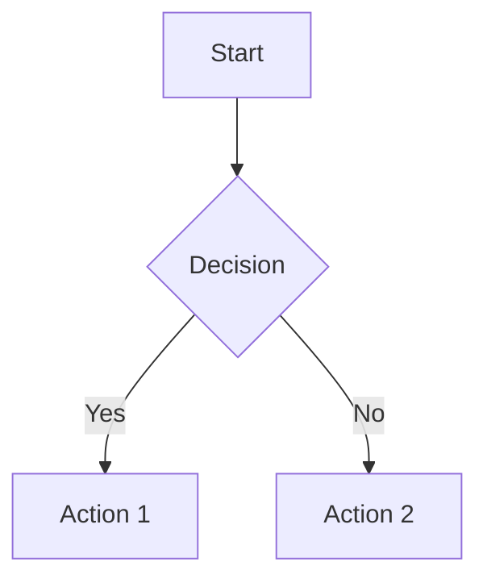

# Instructions Documentation

Quand tu travailles dans le dossier docs:

- Markdown avec structure claire
- Diagrammes Mermaid pour visualisations
- Exemples de code commentés
- Table des matières pour longs documents

```markdown
# Titre du Document

## Table des Matières
- [Section 1](#section-1)
- [Section 2](#section-2)

## Section 1

Description claire et concise.

### Diagramme



### Exemple de Code

\`\`\`typescript
// Code example with explanation
const example = new Example();
\`\`\`
```
