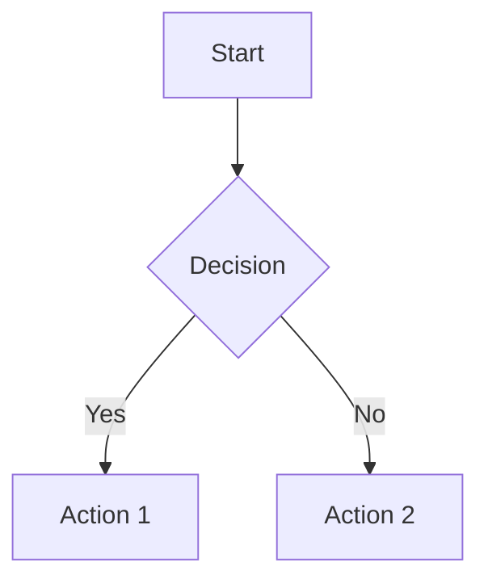

# Instructions Path-Based

## 🎯 Vue d'Ensemble

Ces instructions sont chargées automatiquement selon le chemin du workspace ou des fichiers ouverts.

## 📁 Mapping Chemin → Instructions

### `/src/frontend/**` - Instructions Frontend

Quand tu travailles dans le dossier frontend:

- Utiliser React avec TypeScript
- Composants fonctionnels avec Hooks
- Styled Components ou CSS Modules
- Tests avec React Testing Library
- Accessibilité (WCAG 2.1 AA minimum)

```typescript
// Structure de composant
import { FC, useState, useEffect } from 'react';
import styles from './MyComponent.module.css';

interface MyComponentProps {
  title: string;
  onAction: (data: ActionData) => void;
}

export const MyComponent: FC<MyComponentProps> = ({ title, onAction }) => {
  const [data, setData] = useState<Data | null>(null);
  
  useEffect(() => {
    // Side effects
  }, []);
  
  return (
    <div className={styles.container}>
      <h1>{title}</h1>
      {/* Component content */}
    </div>
  );
};
```

### `/src/backend/**` - Instructions Backend

Quand tu travailles dans le dossier backend:

- Architecture en couches (API → Service → Repository)
- Dependency Injection
- Validation des entrées
- Gestion d'erreurs centralisée
- Logging structuré

```typescript
// Structure de service
@Injectable()
export class UserService {
  constructor(
    private readonly repository: IUserRepository,
    private readonly logger: ILogger
  ) {}
  
  async createUser(dto: CreateUserDto): Promise<User> {
    // Validation
    this.validateUserDto(dto);
    
    // Business logic
    const user = User.create(dto);
    
    // Persistence
    const savedUser = await this.repository.save(user);
    
    // Logging
    this.logger.info('User created', { userId: savedUser.id });
    
    return savedUser;
  }
}
```

### `/infrastructure/**` - Instructions Infrastructure

Quand tu travailles dans le dossier infrastructure:

- Infrastructure as Code (Bicep ou Terraform)
- Variables par environnement
- Modules réutilisables
- Documentation des ressources

```bicep
// Module réutilisable
@description('The location for all resources')
param location string = resourceGroup().location

@description('The environment name')
@allowed(['dev', 'staging', 'prod'])
param environment string

@description('The application name')
param appName string

var resourcePrefix = '${appName}-${environment}'

// Resources definitions...
```

### `/tests/**` - Instructions Tests

Quand tu travailles dans le dossier tests:

- Tests en 3 parties: Arrange, Act, Assert
- Nommage clair et descriptif
- Un seul concept testé par test
- Mocks et stubs appropriés

```typescript
describe('UserService', () => {
  let service: UserService;
  let mockRepository: jest.Mocked<IUserRepository>;
  
  beforeEach(() => {
    mockRepository = createMockRepository();
    service = new UserService(mockRepository);
  });
  
  describe('createUser', () => {
    it('should create user with valid data', async () => {
      // Arrange
      const dto = { name: 'John', email: 'john@example.com' };
      const expectedUser = new User(dto);
      mockRepository.save.mockResolvedValue(expectedUser);
      
      // Act
      const result = await service.createUser(dto);
      
      // Assert
      expect(result).toEqual(expectedUser);
      expect(mockRepository.save).toHaveBeenCalledWith(
        expect.objectContaining(dto)
      );
    });
  });
});
```

### `/docs/**` - Instructions Documentation

Quand tu travailles dans le dossier docs:

- Markdown avec structure claire
- Diagrammes Mermaid pour visualisations
- Exemples de code commentés
- Table des matières pour longs documents

```markdown
# Titre du Document

## Table des Matières
- [Section 1](#section-1)
- [Section 2](#section-2)

## Section 1

Description claire et concise.

### Diagramme



### Exemple de Code

\`\`\`typescript
// Code example with explanation
const example = new Example();
\`\`\`
```

### `/.github/workflows/**` - Instructions CI/CD

Quand tu travailles sur les workflows GitHub Actions:

- Jobs parallèles quand possible
- Caching des dépendances
- Matrix strategy pour multi-versions
- Secrets via GitHub Secrets

```yaml
name: CI

on:
  push:
    branches: [main, develop]
  pull_request:

jobs:
  lint-and-test:
    runs-on: ubuntu-latest
    strategy:
      matrix:
        node-version: [18.x, 20.x]
    
    steps:
      - uses: actions/checkout@v4
      
      - name: Setup Node.js ${{ matrix.node-version }}
        uses: actions/setup-node@v4
        with:
          node-version: ${{ matrix.node-version }}
          cache: 'npm'
      
      - name: Install dependencies
        run: npm ci
      
      - name: Lint
        run: npm run lint
      
      - name: Test
        run: npm test
      
      - name: Upload coverage
        if: matrix.node-version == '20.x'
        uses: codecov/codecov-action@v3
```

## 🎨 Instructions par Type de Fichier

### `*.test.ts` ou `*.spec.ts`

- Tests unitaires avec Jest ou Vitest
- Coverage minimum 80%
- Tester les edge cases
- Utiliser des test.each pour data-driven tests

### `*.bicep` ou `*.tf`

- Paramètres pour configuration
- Outputs pour informations importantes
- Tags sur toutes les ressources
- Naming convention: `{resource-type}-{app}-{env}`

### `Dockerfile`

- Multi-stage builds
- Image de base minimale (alpine)
- Non-root user
- Health checks

```dockerfile
# Build stage
FROM node:20-alpine AS builder
WORKDIR /app
COPY package*.json ./
RUN npm ci --only=production
COPY . .
RUN npm run build

# Production stage
FROM node:20-alpine
RUN addgroup -g 1001 -S nodejs && adduser -S nodejs -u 1001
WORKDIR /app
COPY --from=builder --chown=nodejs:nodejs /app/dist ./dist
COPY --from=builder --chown=nodejs:nodejs /app/node_modules ./node_modules
USER nodejs
EXPOSE 3000
HEALTHCHECK --interval=30s --timeout=3s --start-period=5s --retries=3 \
  CMD node healthcheck.js
CMD ["node", "dist/main.js"]
```

### `docker-compose.yml`

- Services avec health checks
- Volumes pour persistence
- Networks pour isolation
- Environment files pour config

```yaml
version: '3.8'

services:
  api:
    build: ./api
    ports:
      - "3000:3000"
    environment:
      - NODE_ENV=development
      - DATABASE_URL=postgresql://db:5432/myapp
    depends_on:
      db:
        condition: service_healthy
    networks:
      - app-network
    volumes:
      - ./api:/app
      - /app/node_modules
    healthcheck:
      test: ["CMD", "wget", "--quiet", "--tries=1", "--spider", "http://localhost:3000/health"]
      interval: 30s
      timeout: 3s
      retries: 3
  
  db:
    image: postgres:16-alpine
    environment:
      - POSTGRES_DB=myapp
      - POSTGRES_PASSWORD_FILE=/run/secrets/db_password
    secrets:
      - db_password
    volumes:
      - db-data:/var/lib/postgresql/data
    networks:
      - app-network
    healthcheck:
      test: ["CMD-SHELL", "pg_isready -U postgres"]
      interval: 10s
      timeout: 5s
      retries: 5

volumes:
  db-data:

networks:
  app-network:

secrets:
  db_password:
    file: ./secrets/db_password.txt
```

## 🔄 Instructions Contextuelles

### Mode Développement

Quand NODE_ENV=development ou DEBUG=true:

- Logging verbeux
- Source maps activées
- Hot reload
- Pas d'optimisations agressives

### Mode Production

Quand NODE_ENV=production:

- Logging minimal (warn, error)
- Code minifié
- Source maps désactivées ou externes
- Optimisations activées
- Security headers

### Mode Test

Quand NODE_ENV=test:

- Base de données de test
- Mocks par défaut
- Timeouts augmentés
- Pas de rate limiting

## 📊 Métriques et KPIs

### Performance
- API response time < 200ms (p95)
- Frontend load time < 2s
- Database queries < 100ms

### Qualité
- Code coverage > 80%
- Complexity cyclomatique < 10
- Duplication < 3%

### Sécurité
- Aucune vulnérabilité critique
- Dépendances à jour (< 6 mois)
- Security headers configurés
