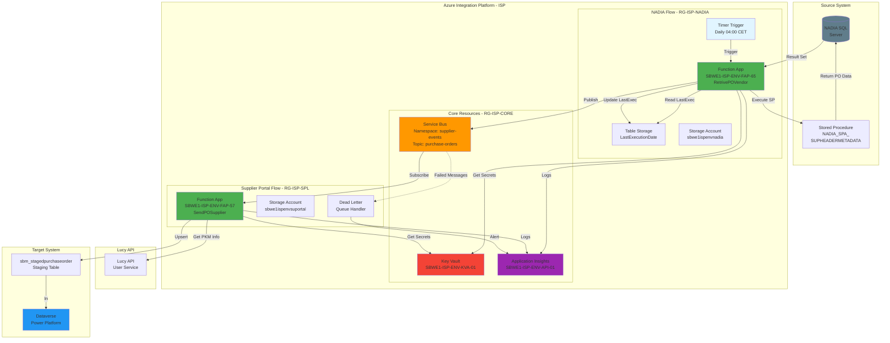
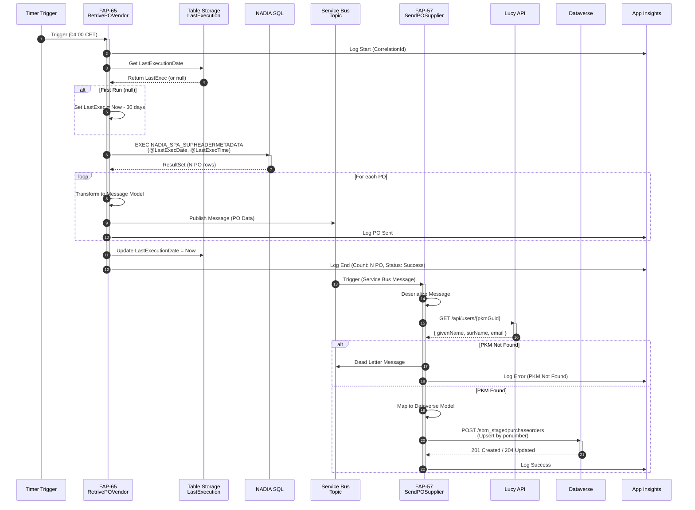
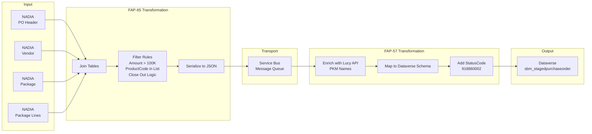
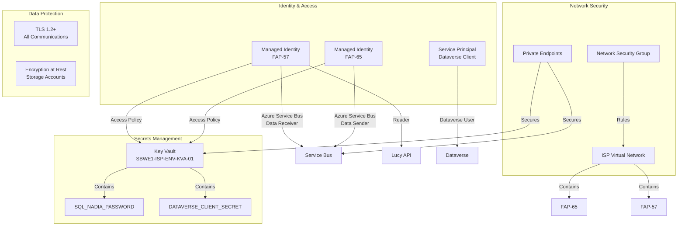
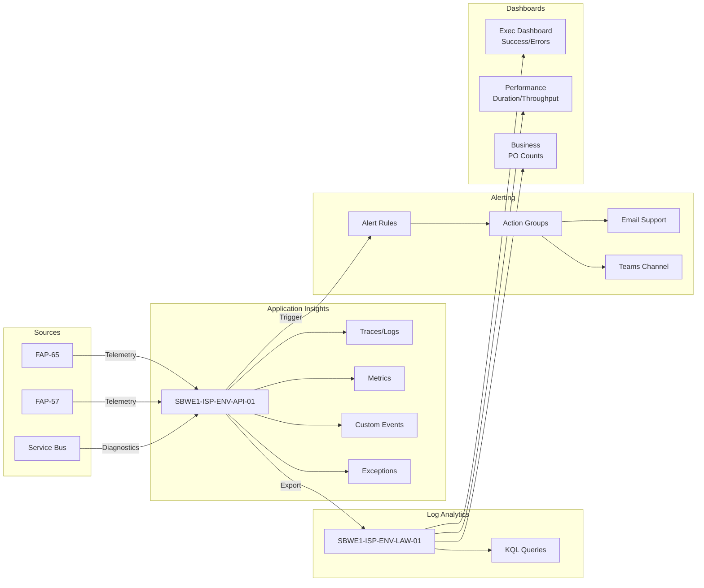

# ARCHITECTURE TECHNIQUE DÉTAILLÉE
## IT 05A - NADIA to Supplier Performance Assessment

**Projet** : Integration Services Platform (ISP)  
**Flow** : IT 05a - NADIA → SPA  
**Document** : Spécifications Techniques  
**Version** : 1.0  
**Date** : 30 janvier 2026  
**Architecte** : Solution Architect - ISP Team

---

## TABLE DES MATIÈRES

1. [Vue d'ensemble de l'architecture](#1-vue-densemble-de-larchitecture)
2. [Architecture applicative](#2-architecture-applicative)
3. [Architecture des données](#3-architecture-des-données)
4. [Architecture d'intégration](#4-architecture-dintégration)
5. [Architecture de sécurité](#5-architecture-de-sécurité)
6. [Architecture de monitoring](#6-architecture-de-monitoring)
7. [Spécifications des composants](#7-spécifications-des-composants)
8. [Infrastructure as Code](#8-infrastructure-as-code)
9. [CI/CD et déploiement](#9-cicd-et-déploiement)
10. [Matrice de décisions techniques](#10-matrice-de-décisions-techniques)

---

## 1. VUE D'ENSEMBLE DE L'ARCHITECTURE

### 1.1 Diagramme d'Architecture Globale



### 1.2 Principes Architecturaux

| Principe | Description | Justification |
|----------|-------------|---------------|
| **Separation of Concerns** | Deux Function Apps distinctes (Extract & Load) | Responsabilités claires, scalabilité indépendante |
| **Async Messaging** | Communication via Service Bus | Découplage, résilience, retry automatique |
| **Managed Identity** | Pas de secrets en code | Sécurité renforcée, rotation automatique |
| **Core Resources Sharing** | Utilisation des ressources ISP Core | Économies, standardisation, monitoring centralisé |
| **Idempotence** | Upsert sur clé unique (ponumber) | Retraitement safe, pas de doublons |
| **Observability** | Logs structurés + métriques | Troubleshooting rapide, alerting proactif |

---

## 2. ARCHITECTURE APPLICATIVE

### 2.1 Diagramme de Séquence Détaillé



### 2.2 Flux de Données



---

## 3. ARCHITECTURE DES DONNÉES

### 3.1 Modèle de Données - Message Service Bus

```csharp
public class PurchaseOrderMessage
{
    [JsonPropertyName("poNumber")]
    public string PoNumber { get; set; }  // Ex: "PO-12345-R01"
    
    [JsonPropertyName("mdmNumber")]
    public string MdmNumber { get; set; }  // Ex: "MDM-67890"
    
    [JsonPropertyName("pkmGuid")]
    public string PkmGuid { get; set; }  // Ex: "12345678-1234-1234-1234-123456789012"
    
    [JsonPropertyName("pkmEmail")]
    public string PkmEmail { get; set; }  // Ex: "john.doe@sbm.com"
    
    [JsonPropertyName("productCode")]
    public string ProductCode { get; set; }  // Ex: "PKG.123.456.789"
    
    [JsonPropertyName("amount")]
    public decimal Amount { get; set; }  // Ex: 250000.50
    
    [JsonPropertyName("firstDelivery")]
    public DateTime? FirstDelivery { get; set; }  // ISO 8601
    
    [JsonPropertyName("lastDelivery")]
    public DateTime? LastDelivery { get; set; }  // ISO 8601
    
    [JsonPropertyName("closeOut")]
    public bool CloseOut { get; set; }  // Calculated
    
    [JsonPropertyName("dateModified")]
    public DateTime DateModified { get; set; }  // ISO 8601
    
    [JsonPropertyName("projectNumber")]
    public string ProjectNumber { get; set; }  // Ex: "PRJ-2025-001"
    
    [JsonPropertyName("description")]
    public string Description { get; set; }  // Ex: "Main turbine package"
}
```

### 3.2 Modèle de Données - Dataverse Staging

```json
{
  "@odata.type": "Microsoft.Dynamics.CRM.sbm_stagedpurchaseorder",
  "sbm_ponumber": "string (100)",
  "sbm_mdmnumber": "string (100)",
  "sbm_pkmpersonid": "string (100) - GUID",
  "sbm_pkmemail": "string (100)",
  "sbm_pkmfirstname": "string (100)",
  "sbm_pkmlastname": "string (100)",
  "sbm_productcode": "string (100)",
  "sbm_amount": "decimal (precision: 2)",
  "sbm_firstdelivery": "dateonly",
  "sbm_lastdelivery": "dateonly",
  "sbm_closeout": "boolean",
  "sbm_erplastupdate": "datetime",
  "sbm_projectnumber": "string (100)",
  "sbm_description": "string (2000)",
  "statuscode": "918860002 (Ready to be Processed)"
}
```

### 3.3 Table Storage - LastExecutionDate

**Table Name**: `LastExecutionDate`

| PartitionKey | RowKey | Timestamp | LastExecutionDate | LastExecutionTime |
|--------------|--------|-----------|-------------------|-------------------|
| NADIA_SPA | DEV | 2026-01-30T04:00:00Z | 2026-01-30 | 04:00:00 |
| NADIA_SPA | STG | 2026-01-30T03:00:00Z | 2026-01-30 | 03:00:00 |
| NADIA_SPA | PRD | 2026-01-30T04:00:00Z | 2026-01-30 | 04:00:00 |

---

## 4. ARCHITECTURE D'INTÉGRATION

### 4.1 Matrice d'Intégration

| Source | Méthode | Protocol | Auth | Target | SLA |
|--------|---------|----------|------|--------|-----|
| Timer | Trigger | - | - | FAP-65 | 99.9% |
| FAP-65 | SQL Query | TDS (SQL) | SQL Auth | NADIA | 99% |
| FAP-65 | Publish | AMQP | Managed Identity | Service Bus | 99.9% |
| Service Bus | Trigger | AMQP | Managed Identity | FAP-57 | 99.9% |
| FAP-57 | HTTP GET | HTTPS/REST | Managed Identity | Lucy API | 99% |
| FAP-57 | HTTP POST | HTTPS/OData | OAuth 2.0 | Dataverse | 99.9% |

### 4.2 Configuration Service Bus

**Namespace**: `SBWE1-ISP-{ENV}-SBN-02` (supplier-events)

**Topic**: `purchase-orders`

**Topic Settings**:
```json
{
  "maxSizeInMegabytes": 5120,
  "defaultMessageTimeToLive": "P1D",
  "requiresDuplicateDetection": true,
  "duplicateDetectionHistoryTimeWindow": "PT10M",
  "enablePartitioning": true,
  "enableBatchedOperations": true
}
```

**Subscription**: `spa-processor`

**Subscription Settings**:
```json
{
  "maxDeliveryCount": 10,
  "lockDuration": "PT5M",
  "deadLetteringOnMessageExpiration": true,
  "deadLetteringOnFilterEvaluationExceptions": true,
  "enableBatchedOperations": true,
  "requiresSession": false
}
```

### 4.3 Retry Policies

**NADIA SQL Connection**:
```csharp
var retryPolicy = Policy
    .Handle<SqlException>()
    .Or<TimeoutException>()
    .WaitAndRetryAsync(
        retryCount: 3,
        sleepDurationProvider: retryAttempt => 
            TimeSpan.FromSeconds(Math.Pow(2, retryAttempt)),
        onRetry: (exception, timeSpan, retryCount, context) =>
        {
            _logger.LogWarning(
                "NADIA connection retry {RetryCount} after {Delay}ms. Error: {Error}",
                retryCount, timeSpan.TotalMilliseconds, exception.Message);
        });
```

**Lucy API**:
```csharp
var retryPolicy = Policy
    .HandleResult<HttpResponseMessage>(r => 
        r.StatusCode == HttpStatusCode.TooManyRequests ||
        (int)r.StatusCode >= 500)
    .WaitAndRetryAsync(
        retryCount: 3,
        sleepDurationProvider: retryAttempt => 
            TimeSpan.FromSeconds(Math.Pow(2, retryAttempt)),
        onRetry: (outcome, timeSpan, retryCount, context) =>
        {
            _logger.LogWarning(
                "Lucy API retry {RetryCount} after {Delay}ms. Status: {StatusCode}",
                retryCount, timeSpan.TotalMilliseconds, outcome.Result.StatusCode);
        });
```

**Dataverse API**:
```csharp
var retryPolicy = Policy
    .HandleResult<HttpResponseMessage>(r => 
        r.StatusCode == HttpStatusCode.TooManyRequests || // 429
        r.StatusCode == HttpStatusCode.ServiceUnavailable) // 503
    .WaitAndRetryAsync(
        retryCount: 5,
        sleepDurationProvider: (retryAttempt, response, context) =>
        {
            // Respect Retry-After header if present
            if (response.Result.Headers.RetryAfter?.Delta.HasValue == true)
                return response.Result.Headers.RetryAfter.Delta.Value;
            
            return TimeSpan.FromSeconds(Math.Pow(2, retryAttempt));
        },
        onRetry: (outcome, timeSpan, retryCount, context) =>
        {
            _logger.LogWarning(
                "Dataverse API retry {RetryCount} after {Delay}ms. Status: {StatusCode}",
                retryCount, timeSpan.TotalMilliseconds, outcome.Result.StatusCode);
        });
```

---

## 5. ARCHITECTURE DE SÉCURITÉ

### 5.1 Diagramme de Sécurité



### 5.2 Matrice de Permissions

| Principal | Resource | Role/Permission | Justification |
|-----------|----------|-----------------|---------------|
| **FAP-65 (MI)** | Key Vault | Get Secrets | Récupération SQL credentials |
| **FAP-65 (MI)** | Service Bus Topic | Azure Service Bus Data Sender | Publier messages PO |
| **FAP-65 (MI)** | Storage Account (nadia) | Storage Blob Data Contributor | Table Storage R/W |
| **FAP-57 (MI)** | Key Vault | Get Secrets | Récupération Dataverse client secret |
| **FAP-57 (MI)** | Service Bus Subscription | Azure Service Bus Data Receiver | Consommer messages |
| **FAP-57 (MI)** | Lucy API | Reader | Récupération infos PKM |
| **FAP-57 (MI)** | Storage Account (suportal) | Storage Blob Data Contributor | Logs et diagnostics |
| **Service Principal** | Dataverse | System Administrator | CRUD sur sbm_stagedpurchaseorder |

### 5.3 Secrets dans Key Vault

| Secret Name | Description | Rotation | Environment |
|-------------|-------------|----------|-------------|
| `NADIA-SQL-PASSWORD-{ENV}` | Mot de passe compte SQL NADIA | 90 jours | DEV/STG/PRD |
| `SUPPLIER-PORTAL-DATAVERSE-CLIENT-SECRET` | OAuth Client Secret Dataverse | 90 jours | DEV/STG/PRD |
| `LUCY-API-KEY` | API Key Lucy (backup si MI échoue) | 90 jours | DEV/STG/PRD |

### 5.4 Network Security Rules

**NSG Rules - Inbound**:
| Priority | Name | Source | Destination | Port | Action |
|----------|------|--------|-------------|------|--------|
| 100 | Allow-HTTPS-From-APIM | APIM Subnet | Function Apps | 443 | Allow |
| 200 | Allow-Management | Azure Management | Function Apps | 443 | Allow |
| 300 | Deny-All-Inbound | Any | Any | Any | Deny |

**NSG Rules - Outbound**:
| Priority | Name | Source | Destination | Port | Action |
|----------|------|--------|-------------|------|--------|
| 100 | Allow-SQL-To-NADIA | Function Apps | NADIA SQL | 1433 | Allow |
| 110 | Allow-HTTPS-To-Lucy | Function Apps | Lucy API | 443 | Allow |
| 120 | Allow-HTTPS-To-Dataverse | Function Apps | Dataverse | 443 | Allow |
| 130 | Allow-Service-Bus | Function Apps | Service Bus | 443 | Allow |
| 200 | Allow-Azure-Services | Function Apps | Azure Services | 443 | Allow |
| 300 | Deny-All-Outbound | Any | Any | Any | Deny |

---

## 6. ARCHITECTURE DE MONITORING

### 6.1 Diagramme de Monitoring



### 6.2 Métriques Clés (KPIs)

| Métrique | Type | Seuil Alerte | Description |
|----------|------|--------------|-------------|
| **ExecutionDuration** | Duration | > 30 min | Durée totale d'une exécution |
| **POProcessed** | Count | < 1 (anomalie) | Nombre de PO traités |
| **POSuccess** | Count | - | Nombre de PO envoyés avec succès |
| **POError** | Count | > 10 | Nombre de PO en erreur |
| **PKMNotFound** | Count | > 5 | PKM non trouvés dans Lucy |
| **DataverseThrottling** | Count | > 0 | Requêtes throttled par Dataverse |
| **DeadLetterMessages** | Count | > 0 | Messages en dead letter queue |
| **AvgProcessingTime** | Duration | > 2 sec/PO | Temps moyen par PO |

### 6.3 Custom Events

```csharp
public static class TelemetryEvents
{
    // FAP-65 Events
    public const string ExecutionStarted = "NADIA_Execution_Started";
    public const string ExecutionCompleted = "NADIA_Execution_Completed";
    public const string PORetrieved = "NADIA_PO_Retrieved";
    public const string POFiltered = "NADIA_PO_Filtered";
    public const string POPublished = "NADIA_PO_Published";
    
    // FAP-57 Events
    public const string MessageReceived = "SPA_Message_Received";
    public const string PKMEnriched = "SPA_PKM_Enriched";
    public const string PKMNotFound = "SPA_PKM_NotFound";
    public const string DataverseSent = "SPA_Dataverse_Sent";
    public const string DataverseError = "SPA_Dataverse_Error";
}
```

**Exemple d'utilisation**:
```csharp
telemetryClient.TrackEvent(
    TelemetryEvents.ExecutionCompleted,
    properties: new Dictionary<string, string>
    {
        { "CorrelationId", correlationId },
        { "Environment", environment },
        { "POProcessed", poCount.ToString() },
        { "POSuccess", successCount.ToString() },
        { "POError", errorCount.ToString() },
        { "Duration", duration.ToString() }
    },
    metrics: new Dictionary<string, double>
    {
        { "DurationSeconds", duration.TotalSeconds },
        { "POPerSecond", poCount / duration.TotalSeconds }
    });
```

### 6.4 Alertes Configurées

| Alert Name | Condition | Severity | Action Group |
|------------|-----------|----------|--------------|
| **NADIA_SPA_Execution_Failed** | ExecutionCompleted.Status = "Failed" | Critical | Email + Teams |
| **NADIA_SPA_High_Error_Rate** | POError > 10 in 5 min | High | Email + Teams |
| **NADIA_SPA_PKM_Not_Found** | PKMNotFound > 5 in 15 min | Medium | Email |
| **NADIA_SPA_Slow_Execution** | ExecutionDuration > 30 min | Medium | Email |
| **NADIA_SPA_Dead_Letter_Queue** | DeadLetterMessages > 0 | High | Email + Teams |
| **NADIA_SPA_Dataverse_Throttling** | DataverseThrottling > 0 | High | Email |

### 6.5 Dashboard standard ISP (obligatoire)

Un **workbook App Insights** standard est requis pour chaque flux ISP. Le template est stocké dans le repo et doit être importé dans le Workspace `SBWE1-ISP-{ENV}-API-01`.

- Template Workbook: [src/NADIA/monitoring/ISP-NADIA-SPA-Dashboard.workbook.json](src/NADIA/monitoring/ISP-NADIA-SPA-Dashboard.workbook.json)
- Guide d’import: [src/NADIA/monitoring/README.md](src/NADIA/monitoring/README.md)

---

## 7. SPÉCIFICATIONS DES COMPOSANTS

### 7.1 Function App FAP-65 - RetrivePurchaseOrderVendor

**Configuration**:
```json
{
  "name": "SBWE1-ISP-{ENV}-FAP-65",
  "resourceGroup": "IntegrationServices-VEN-RG",
  "runtime": "dotnet-isolated",
  "version": "8.0",
  "plan": "SBWE1-ISP-{ENV}-ASP-01 (Consumption)",
  "region": "West Europe",
  "storageAccount": "sbwe1isp{env}nadia"
}
```

**Application Settings**:
```json
{
  "FUNCTIONS_WORKER_RUNTIME": "dotnet-isolated",
  "WEBSITE_RUN_FROM_PACKAGE": "1",
  "APPINSIGHTS_INSTRUMENTATIONKEY": "@Microsoft.KeyVault(SecretUri=https://sbwe1isp{env}kva01.vault.azure.net/secrets/AppInsights-Key)",
  "NadiaConnectionString": "Server=nadia-db-{env}.corpnet.singlebuoy.com;Database=NADIA;User Id=SQL_NADIA_IFS_AZURE_{ENV};Password=@Microsoft.KeyVault(...)",
  "ServiceBusConnection__fullyQualifiedNamespace": "sbwe1-isp-{env}-sbn-02.servicebus.windows.net",
  "StorageAccount": "DefaultEndpointsProtocol=https;AccountName=sbwe1isp{env}nadia;...",
  "TimerSchedule": "0 0 4 * * *"
}
```

**Functions**:

1. **RetrivePOVendor** (Timer Trigger)
```csharp
[Function("RetrivePOVendor")]
public async Task Run(
    [TimerTrigger("%TimerSchedule%")] TimerInfo timer,
    FunctionContext context)
{
    // 1. Get last execution date from Table Storage
    // 2. Execute NADIA stored procedure
    // 3. Transform and publish to Service Bus
    // 4. Update last execution date
}
```

**Dépendances NuGet**:
```xml
<ItemGroup>
    <PackageReference Include="Microsoft.Azure.Functions.Worker" Version="1.21.0" />
    <PackageReference Include="Microsoft.Azure.Functions.Worker.Extensions.Timer" Version="4.3.0" />
    <PackageReference Include="Microsoft.Azure.Functions.Worker.Extensions.ServiceBus" Version="5.16.0" />
    <PackageReference Include="Azure.Data.Tables" Version="12.8.3" />
    <PackageReference Include="Microsoft.Data.SqlClient" Version="5.1.5" />
    <PackageReference Include="Azure.Identity" Version="1.11.0" />
    <PackageReference Include="Microsoft.ApplicationInsights.WorkerService" Version="2.22.0" />
    <PackageReference Include="Polly" Version="8.3.1" />
</ItemGroup>
```

---

### 7.2 Function App FAP-57 - SendPurchaseOrderSupplier

**Configuration**:
```json
{
  "name": "SBWE1-ISP-{ENV}-FAP-57",
  "resourceGroup": "IntegrationServicesSTG-SPL-RG",
  "runtime": "dotnet-isolated",
  "version": "8.0",
  "plan": "SBWE1-ISP-{ENV}-ASP-01 (Consumption)",
  "region": "West Europe",
  "storageAccount": "sbwe1isp{env}suportal"
}
```

**Application Settings**:
```json
{
  "FUNCTIONS_WORKER_RUNTIME": "dotnet-isolated",
  "APPINSIGHTS_INSTRUMENTATIONKEY": "@Microsoft.KeyVault(...)",
  "ServiceBusConnection__fullyQualifiedNamespace": "sbwe1-isp-{env}-sbn-02.servicebus.windows.net",
  "LucyApiBaseUrl": "https://lucy-api-{env}.sbm.com",
  "DataverseApiBaseUrl": "https://sbmsupplierportal{env}.crm4.dynamics.com/api/data/v9.2",
  "DataverseClientId": "#{DataverseClientId}#",
  "DataverseClientSecret": "@Microsoft.KeyVault(SecretUri=https://sbwe1isp{env}kva01.vault.azure.net/secrets/SUPPLIER-PORTAL-DATAVERSE-CLIENT-SECRET)",
  "DataverseTenantId": "#{DataverseTenantId}#",
  "StorageAccount": "DefaultEndpointsProtocol=https;AccountName=sbwe1isp{env}suportal;..."
}
```

**Functions**:

1. **SendPOSupplier** (Service Bus Trigger)
```csharp
[Function("SendPOSupplier")]
public async Task Run(
    [ServiceBusTrigger("purchase-orders", "spa-processor", Connection = "ServiceBusConnection")] 
    ServiceBusReceivedMessage message,
    ServiceBusMessageActions messageActions,
    FunctionContext context)
{
    // 1. Deserialize message
    // 2. Call Lucy API to get PKM info
    // 3. Map to Dataverse model
    // 4. Upsert to Dataverse
    // 5. Complete or Dead Letter message
}
```

**Dépendances NuGet**:
```xml
<ItemGroup>
    <PackageReference Include="Microsoft.Azure.Functions.Worker" Version="1.21.0" />
    <PackageReference Include="Microsoft.Azure.Functions.Worker.Extensions.ServiceBus" Version="5.16.0" />
    <PackageReference Include="Microsoft.PowerPlatform.Dataverse.Client" Version="1.1.14" />
    <PackageReference Include="Azure.Identity" Version="1.11.0" />
    <PackageReference Include="Microsoft.ApplicationInsights.WorkerService" Version="2.22.0" />
    <PackageReference Include="Polly" Version="8.3.1" />
</ItemGroup>
```

---

## 8. INFRASTRUCTURE AS CODE

### 8.1 Terraform - Structure

```
terraform/
├── main.tf                  # Main resources
├── variables.tf             # Input variables
├── outputs.tf               # Outputs
├── providers.tf             # Azure provider config
├── backend.tf               # Remote state config
├── modules/
│   ├── function-app/
│   │   ├── main.tf
│   │   ├── variables.tf
│   │   └── outputs.tf
│   ├── service-bus-topic/
│   │   ├── main.tf
│   │   ├── variables.tf
│   │   └── outputs.tf
│   └── storage-account/
│       ├── main.tf
│       ├── variables.tf
│       └── outputs.tf
└── environments/
    ├── dev.tfvars
    ├── stg.tfvars
    └── prd.tfvars
```

### 8.2 Terraform - Main Resources

**main.tf**:
```hcl
terraform {
  required_version = ">= 1.6"
  required_providers {
    azurerm = {
      source  = "hashicorp/azurerm"
      version = "~> 3.85"
    }
  }
}

provider "azurerm" {
  features {}
}

# Data sources pour les ressources Core existantes
data "azurerm_key_vault" "core" {
  name                = "SBWE1-ISP-${var.env}-KVA-01"
  resource_group_name = "IntegrationServices${var.env_suffix}-CMN-RG"
}

data "azurerm_servicebus_namespace" "core" {
  name                = "SBWE1-ISP-${var.env}-SBN-02"
  resource_group_name = "IntegrationServices${var.env_suffix}-CMN-RG"
}

data "azurerm_application_insights" "core" {
  name                = "SBWE1-ISP-${var.env}-API-01"
  resource_group_name = "IntegrationServices${var.env_suffix}-CMN-RG"
}

# Resource Group - NADIA
resource "azurerm_resource_group" "nadia" {
  name     = "IntegrationServices${var.env_suffix}-NDA-RG"
  location = var.location

  tags = {
    env  = var.environment
    flow = "NADIA"
    desc = "NADIA to SPA Integration"
  }
}

# Storage Account - NADIA
resource "azurerm_storage_account" "nadia" {
  name                     = "sbwe1isp${var.env}nadia"
  resource_group_name      = azurerm_resource_group.nadia.name
  location                 = azurerm_resource_group.nadia.location
  account_tier             = "Standard"
  account_replication_type = "LRS"
  min_tls_version          = "TLS1_2"
  
  tags = {
    env  = var.environment
    flow = "NADIA"
  }
}

# Function App - FAP-65
module "function_app_65" {
  source = "./modules/function-app"
  
  name                = "SBWE1-ISP-${var.env}-FAP-65"
  resource_group_name = azurerm_resource_group.nadia.name
  location            = azurerm_resource_group.nadia.location
  storage_account_name = azurerm_storage_account.nadia.name
  app_service_plan_id = data.azurerm_app_service_plan.core.id
  
  app_settings = {
    "FUNCTIONS_WORKER_RUNTIME"                         = "dotnet-isolated"
    "APPINSIGHTS_INSTRUMENTATIONKEY"                   = data.azurerm_application_insights.core.instrumentation_key
    "ServiceBusConnection__fullyQualifiedNamespace"    = "${data.azurerm_servicebus_namespace.core.name}.servicebus.windows.net"
    "NadiaConnectionString"                            = "@Microsoft.KeyVault(SecretUri=${data.azurerm_key_vault.core.vault_uri}secrets/NADIA-SQL-CONNECTION)"
    "TimerSchedule"                                    = var.timer_schedule
  }
  
  tags = {
    env  = var.environment
    flow = "NADIA"
    desc = "Retrieve PO from NADIA"
  }
}

# Service Bus Topic
module "servicebus_topic" {
  source = "./modules/service-bus-topic"
  
  name                = "purchase-orders"
  namespace_name      = data.azurerm_servicebus_namespace.core.name
  resource_group_name = data.azurerm_servicebus_namespace.core.resource_group_name
  
  max_size_in_megabytes           = 5120
  requires_duplicate_detection    = true
  duplicate_detection_window      = "PT10M"
  enable_partitioning             = true
}

# Service Bus Subscription
resource "azurerm_servicebus_subscription" "spa_processor" {
  name                                 = "spa-processor"
  topic_id                             = module.servicebus_topic.id
  max_delivery_count                   = 10
  lock_duration                        = "PT5M"
  dead_lettering_on_message_expiration = true
  enable_batched_operations            = true
}

# Role Assignments
resource "azurerm_role_assignment" "fap65_servicebus_sender" {
  scope                = data.azurerm_servicebus_namespace.core.id
  role_definition_name = "Azure Service Bus Data Sender"
  principal_id         = module.function_app_65.principal_id
}

resource "azurerm_role_assignment" "fap57_servicebus_receiver" {
  scope                = data.azurerm_servicebus_namespace.core.id
  role_definition_name = "Azure Service Bus Data Receiver"
  principal_id         = module.function_app_57.principal_id
}

resource "azurerm_role_assignment" "fap65_keyvault" {
  scope                = data.azurerm_key_vault.core.id
  role_definition_name = "Key Vault Secrets User"
  principal_id         = module.function_app_65.principal_id
}
```

---

## 9. CI/CD ET DÉPLOIEMENT

### 9.1 Pipelines Azure DevOps

**Build Pipeline - NADIA**:
```yaml
trigger:
  branches:
    include:
      - feature/nadia/*
      - main
  paths:
    include:
      - src/NADIA/*
      - terraform/

pool:
  vmImage: 'ubuntu-latest'

variables:
  buildConfiguration: 'Release'

stages:
- stage: Build
  jobs:
  - job: BuildFAP65
    steps:
    - task: UseDotNet@2
      inputs:
        version: '8.x'
    
    - task: DotNetCoreCLI@2
      displayName: 'Restore'
      inputs:
        command: 'restore'
        projects: 'src/NADIA/FAP-65/**/*.csproj'
    
    - task: DotNetCoreCLI@2
      displayName: 'Build'
      inputs:
        command: 'build'
        projects: 'src/NADIA/FAP-65/**/*.csproj'
        arguments: '--configuration $(buildConfiguration)'
    
    - task: DotNetCoreCLI@2
      displayName: 'Test'
      inputs:
        command: 'test'
        projects: 'tests/NADIA.Tests/**/*.csproj'
        arguments: '--configuration $(buildConfiguration) --collect:"XPlat Code Coverage"'
    
    - task: DotNetCoreCLI@2
      displayName: 'Publish'
      inputs:
        command: 'publish'
        projects: 'src/NADIA/FAP-65/**/*.csproj'
        arguments: '--configuration $(buildConfiguration) --output $(Build.ArtifactStagingDirectory)/fap65'
        zipAfterPublish: true
    
    - task: PublishBuildArtifacts@1
      inputs:
        PathtoPublish: '$(Build.ArtifactStagingDirectory)/fap65'
        ArtifactName: 'fap65'

- stage: TerraformValidate
  jobs:
  - job: Validate
    steps:
    - task: TerraformInstaller@0
      inputs:
        terraformVersion: '1.6.6'
    
    - task: TerraformTaskV4@4
      displayName: 'Terraform Init'
      inputs:
        provider: 'azurerm'
        command: 'init'
        workingDirectory: '$(System.DefaultWorkingDirectory)/terraform'
        backendServiceArm: 'ISP-DevOps-Connection'
        backendAzureRmResourceGroupName: 'ISP-Terraform-RG'
        backendAzureRmStorageAccountName: 'ispterraformstate'
        backendAzureRmContainerName: 'tfstate'
        backendAzureRmKey: 'nadia-spa.tfstate'
    
    - task: TerraformTaskV4@4
      displayName: 'Terraform Validate'
      inputs:
        provider: 'azurerm'
        command: 'validate'
        workingDirectory: '$(System.DefaultWorkingDirectory)/terraform'
    
    - task: TerraformTaskV4@4
      displayName: 'Terraform Plan (DEV)'
      inputs:
        provider: 'azurerm'
        command: 'plan'
        workingDirectory: '$(System.DefaultWorkingDirectory)/terraform'
        commandOptions: '-var-file="environments/dev.tfvars" -out=tfplan'
        environmentServiceNameAzureRM: 'ISP-DevOps-Connection'
```

**Release Pipeline - NADIA to SPA**:
```yaml
stages:
- stage: DeployDEV
  displayName: 'Deploy to DEV'
  jobs:
  - deployment: DeployInfrastructure
    displayName: 'Deploy Infrastructure (Terraform)'
    environment: 'ISP-DEV'
    strategy:
      runOnce:
        deploy:
          steps:
          - task: TerraformTaskV4@4
            displayName: 'Terraform Apply'
            inputs:
              provider: 'azurerm'
              command: 'apply'
              workingDirectory: '$(Pipeline.Workspace)/terraform'
              commandOptions: '-var-file="environments/dev.tfvars" -auto-approve'
              environmentServiceNameAzureRM: 'ISP-DEV-Connection'
  
  - deployment: DeployFAP65
    displayName: 'Deploy Function App FAP-65'
    dependsOn: DeployInfrastructure
    environment: 'ISP-DEV'
    strategy:
      runOnce:
        deploy:
          steps:
          - task: AzureFunctionApp@2
            inputs:
              azureSubscription: 'ISP-DEV-Connection'
              appType: 'functionApp'
              appName: 'SBWE1-ISP-DV-FAP-65'
              package: '$(Pipeline.Workspace)/fap65/**/*.zip'
              deploymentMethod: 'runFromPackage'

- stage: DeploySTG
  displayName: 'Deploy to STG'
  dependsOn: DeployDEV
  condition: succeeded()
  jobs:
  - deployment: DeployInfrastructure
    displayName: 'Deploy Infrastructure'
    environment: 'ISP-STG'
    strategy:
      runOnce:
        preDeploy:
          steps:
          - task: ManualValidation@0
            displayName: 'Manual Approval'
            inputs:
              notifyUsers: 'john.doe@sbm.com'
              instructions: 'Please validate DEV deployment before proceeding to STG'
        deploy:
          steps:
          - task: TerraformTaskV4@4
            displayName: 'Terraform Apply'
            inputs:
              provider: 'azurerm'
              command: 'apply'
              workingDirectory: '$(Pipeline.Workspace)/terraform'
              commandOptions: '-var-file="environments/stg.tfvars" -auto-approve'
              environmentServiceNameAzureRM: 'ISP-STG-Connection'

- stage: DeployPRD
  displayName: 'Deploy to PRD'
  dependsOn: DeploySTG
  condition: and(succeeded(), eq(variables['Build.SourceBranch'], 'refs/heads/main'))
  jobs:
  - deployment: DeployInfrastructure
    displayName: 'Deploy Infrastructure'
    environment: 'ISP-PRD'
    strategy:
      runOnce:
        preDeploy:
          steps:
          - task: ManualValidation@0
            displayName: 'Manual Approval (CAB)'
            inputs:
              notifyUsers: 'production-approvers@sbm.com'
              instructions: 'CAB Approval required. Validate STG deployment and change ticket before proceeding.'
        deploy:
          steps:
          - task: TerraformTaskV4@4
            displayName: 'Terraform Apply'
            inputs:
              provider: 'azurerm'
              command: 'apply'
              workingDirectory: '$(Pipeline.Workspace)/terraform'
              commandOptions: '-var-file="environments/prd.tfvars" -auto-approve'
              environmentServiceNameAzureRM: 'ISP-PRD-Connection'
```

---

## 10. MATRICE DE DÉCISIONS TECHNIQUES

| Décision | Options Considérées | Choix Final | Justification |
|----------|---------------------|-------------|---------------|
| **Runtime Function Apps** | .NET 6, .NET 8, Node.js | .NET 8 Isolated | Performance, async/await, support long-terme Microsoft |
| **Messaging** | Service Bus, Event Grid, Storage Queue | Service Bus Topic | Fiabilité, retry natif, dead-letter, sessions |
| **Authentification NADIA** | SQL Auth, Managed Identity | SQL Auth | NADIA ne supporte pas MI pour SQL Server |
| **Authentification Dataverse** | OAuth 2.0, Service Principal, MI | OAuth 2.0 Client Cred | Standard Dataverse, rotation de secrets |
| **Enrichissement PKM** | Lucy API, Direct Entra ID Graph | Lucy API | Abstraction, cache existant, moins de dépendances |
| **Stockage LastExec** | SQL Table, Blob Storage, Table Storage | Table Storage | Coût bas, latence faible, simple |
| **Batching Dataverse** | 1 record/call, 50 records/batch | 50 records/batch | Réduction throttling, performance |
| **Retry Policy** | Constant, Linear, Exponential | Exponential Backoff | Évite surcharge, standard de l'industrie |
| **Logs** | App Insights, Log Analytics, Both | Both (AI export vers LA) | Flexibilité KQL, rétention |
| **IaC Tool** | Terraform, Bicep, ARM | Terraform | Multi-cloud, modularité, state management |

---

## ANNEXES

### A. Endpoints

| Environment | NADIA SQL | Lucy API | Dataverse |
|-------------|-----------|----------|-----------|
| **DEV** | nadia-db-stg.corpnet.singlebuoy.com | lucy-api-dev.sbm.com | sbmsupplierportaltest.crm4.dynamics.com |
| **STG** | nadia-db-stg.corpnet.singlebuoy.com | lucy-api-stg.sbm.com | sbmsupplierportaluat.crm4.dynamics.com |
| **PRD** | nadia-db-prd.corpnet.singlebuoy.com | lucy-api-prd.sbm.com | (TBD) |

### B. Contacts

| Rôle | Équipe | Email |
|------|--------|-------|
| **Architecte Solution** | MiddleWay | architect@middleway.com |
| **Lead Développeur** | MiddleWay | dev-lead@middleway.com |
| **NADIA Admin** | SBM IT | nadia-admin@sbm.com |
| **Dataverse Admin** | SBM IT | dataverse-admin@sbm.com |
| **Support 24/7** | MiddleWay | support@middleway.com |

---

**Document préparé par** : Solution Architect - ISP Team  
**Version** : 1.0  
**Date** : 30 janvier 2026  
**Statut** : 🟡 En Revue

**NEXT STEP** : Développement (Phase 3)  
Handoff vers l'équipe de développement pour implémentation du code source.
