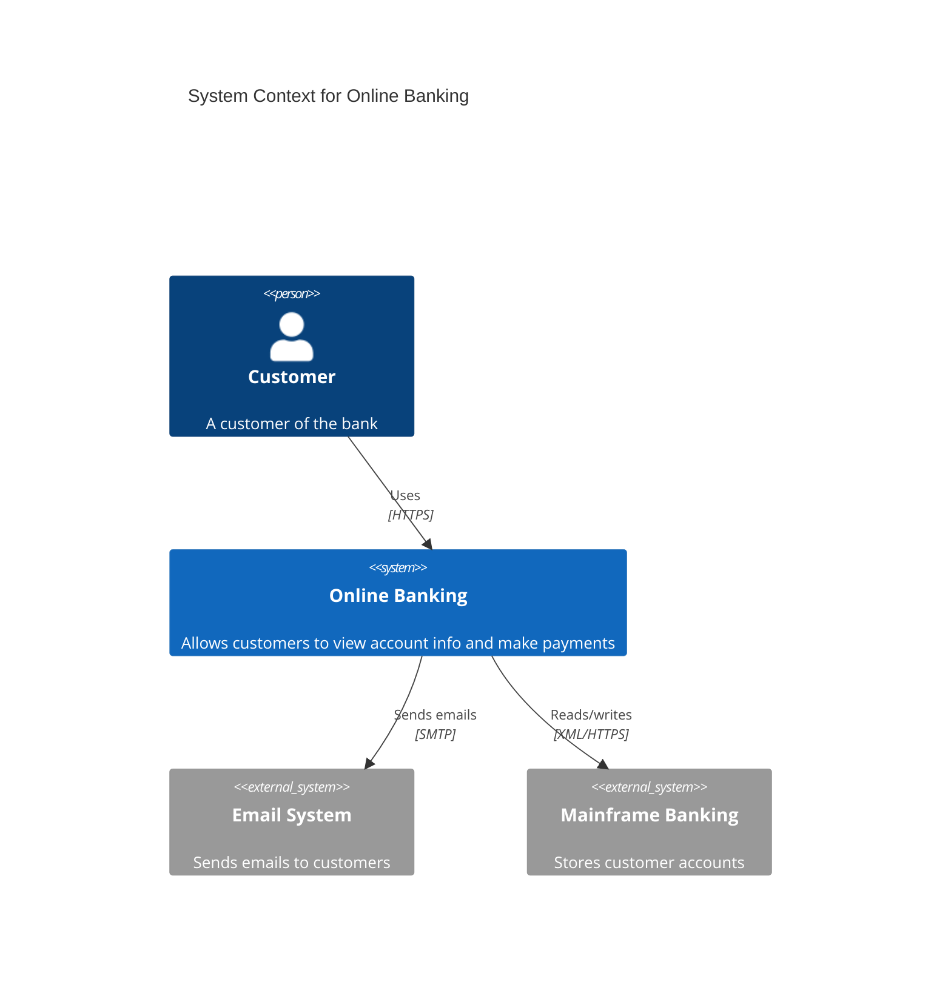
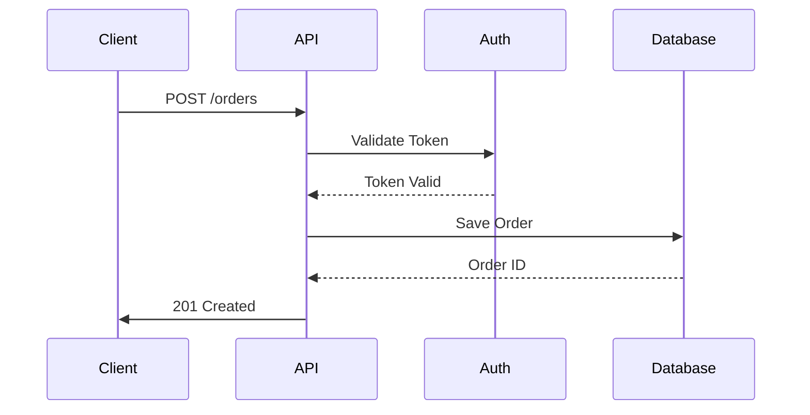
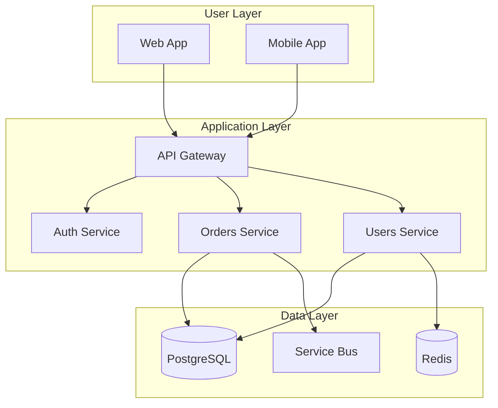
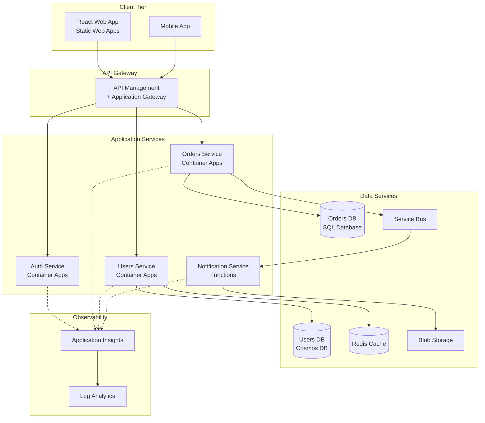
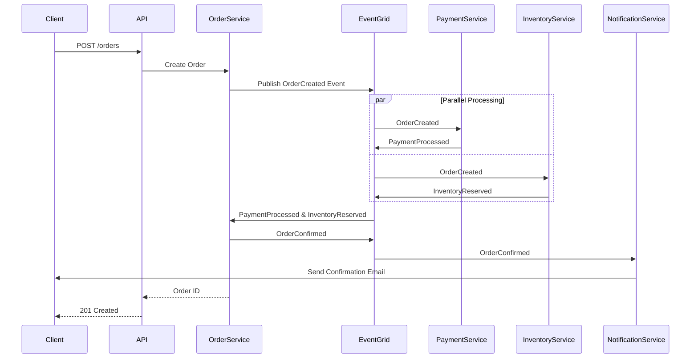

# Skill: Diagram Creation

## 🎯 Objectif

Créer des diagrammes d'architecture clairs et professionnels pour visualiser des systèmes, flux et structures.

## 📋 Types de Diagrammes Supportés

### 1. C4 Model
- **Context**: Système dans son environnement
- **Container**: Composants de haut niveau
- **Component**: Structure interne des containers
- **Code**: Classes et interfaces (rarement utilisé)

### 2. UML Diagrams
- **Class**: Structure des classes
- **Sequence**: Interactions temporelles
- **Activity**: Flux de travail
- **State**: États et transitions
- **Deployment**: Infrastructure physique

### 3. Architecture Diagrams
- **System Architecture**: Vue d'ensemble du système
- **Network**: Topologie réseau
- **Data Flow**: Flux de données
- **Infrastructure**: Ressources cloud/on-prem

## 🔧 Outils

### Mermaid (pour diagrammes simples/rapides)

#### C4 Context Diagram


#### Sequence Diagram


#### Architecture Diagram


### DrawIO (pour diagrammes complexes)

#### Template Azure Architecture
```xml
<mxfile>
  <diagram name="Azure Architecture">
    <mxGraphModel>
      <root>
        <mxCell id="0"/>
        <mxCell id="1" parent="0"/>
        
        <!-- Azure Region -->
        <mxCell id="region" value="Azure Region - West Europe" 
                style="rounded=1;whiteSpace=wrap;html=1;fillColor=#dae8fc;strokeColor=#6c8ebf;" 
                vertex="1" parent="1">
          <mxGeometry x="40" y="40" width="720" height="600" as="geometry"/>
        </mxCell>
        
        <!-- Virtual Network -->
        <mxCell id="vnet" value="Virtual Network" 
                style="rounded=1;whiteSpace=wrap;html=1;fillColor=#e1d5e7;strokeColor=#9673a6;" 
                vertex="1" parent="1">
          <mxGeometry x="80" y="100" width="640" height="500" as="geometry"/>
        </mxCell>
        
        <!-- Subnet 1 -->
        <mxCell id="subnet1" value="Subnet: Web Tier" 
                style="rounded=1;whiteSpace=wrap;html=1;fillColor=#fff2cc;strokeColor=#d6b656;" 
                vertex="1" parent="1">
          <mxGeometry x="120" y="150" width="560" height="150" as="geometry"/>
        </mxCell>
        
        <!-- Container Apps -->
        <mxCell id="containerApp" value="Container Apps" 
                style="rounded=1;whiteSpace=wrap;html=1;fillColor=#d5e8d4;strokeColor=#82b366;" 
                vertex="1" parent="1">
          <mxGeometry x="160" y="190" width="200" height="80" as="geometry"/>
        </mxCell>
      </root>
    </mxGraphModel>
  </diagram>
</mxfile>
```

## 📐 Méthode de Création

### Étape 1: Comprendre le Contexte
**Questions à poser**:
- Quel est l'objectif du diagramme?
- Qui est l'audience?
- Quel niveau de détail est nécessaire?
- Y a-t-il des contraintes techniques?

### Étape 2: Choisir le Type de Diagramme
**Critères de sélection**:
- **C4 Context**: Vue d'ensemble pour stakeholders non-techniques
- **C4 Container**: Vue technique pour développeurs/architectes
- **Sequence**: Comprendre les interactions temporelles
- **Architecture**: Montrer infrastructure et déploiement

### Étape 3: Identifier les Composants
**Lister**:
- Acteurs (utilisateurs, systèmes externes)
- Services/Applications
- Bases de données
- Files d'attente / Message buses
- Caches
- Ressources cloud spécifiques

### Étape 4: Définir les Relations
**Types de relations**:
- **Synchrone**: HTTP/REST, gRPC
- **Asynchrone**: Events, Messages
- **Lecture/Écriture**: Database, Storage
- **Dépendances**: Services externes

### Étape 5: Ajouter les Détails
**Informations supplémentaires**:
- Protocoles (HTTPS, AMQP, etc.)
- Ports
- Technologies utilisées
- Patterns de communication

## 💡 Best Practices

### Clarté
- **Une idée par diagramme**: Ne pas surcharger
- **Légende**: Expliquer les symboles et couleurs
- **Titres explicites**: "Order Processing Flow" vs "Diagram 1"
- **Annotations**: Ajouter notes pour contexte

### Cohérence
- **Couleurs**: Même couleur = même type
  - Bleu: Services métier
  - Vert: Databases
  - Orange: Files d'attente
  - Gris: Services externes
- **Formes**: Standardiser les icônes
- **Nomenclature**: Conventions de nommage cohérentes

### Niveau de Détail
- **Context**: Haut niveau, peu de détails
- **Container**: Composants majeurs, technologies
- **Component**: Classes et modules
- **Éviter**: Trop de détails techniques dans diagrammes haut niveau

### Documentation
```markdown
# Architecture Diagram

## Context
This diagram shows the high-level architecture of the Order Management System.

## Components

### Frontend
- **Web App**: React SPA hosted on Azure Static Web Apps
- **Mobile App**: React Native app for iOS/Android

### Backend Services
- **API Gateway**: Azure API Management
- **Auth Service**: Azure AD B2C
- **Order Service**: Container Apps (Node.js)
- **User Service**: Container Apps (.NET)

### Data Layer
- **Orders DB**: Azure SQL Database
- **Users DB**: Cosmos DB
- **Cache**: Azure Cache for Redis
- **Message Queue**: Service Bus

## Data Flow
1. User authenticates via Azure AD B2C
2. Requests go through API Gateway
3. Gateway routes to appropriate service
4. Services communicate via Service Bus for async operations
5. Data stored in respective databases

## Security
- All communication over HTTPS
- Managed Identity between Azure services
- Private endpoints for databases
```

## 🎨 Templates Prêts à l'Emploi

### Template Microservices avec Azure



### Template Event-Driven Architecture



## 🔍 Checklist de Validation

Avant de finaliser un diagramme:

- [ ] **Complet**: Tous les composants importants sont présents
- [ ] **Clair**: Facile à comprendre sans explications
- [ ] **Correct**: Représente fidèlement l'architecture
- [ ] **Cohérent**: Style uniforme dans tout le diagramme
- [ ] **Contextualisé**: Titre et légende appropriés
- [ ] **Commenté**: Documentation accompagnant le diagramme
- [ ] **Versionné**: Numéro de version et date
- [ ] **Maintenu**: Plan pour mettre à jour

## 🚀 Workflow de Création

1. **Analyse**: Recueillir les besoins et contraintes
2. **Esquisse**: Brouillon rapide sur papier
3. **Création**: Utiliser Mermaid ou DrawIO
4. **Revue**: Valider avec l'équipe technique
5. **Refinement**: Ajuster selon feedback
6. **Documentation**: Ajouter explications détaillées
7. **Publication**: Partager avec stakeholders
8. **Maintenance**: Mettre à jour régulièrement

## 📚 Ressources

- [C4 Model](https://c4model.com/)
- [Mermaid Documentation](https://mermaid.js.org/)
- [Azure Architecture Icons](https://learn.microsoft.com/azure/architecture/icons/)
- [DrawIO Templates](https://www.drawio.com/blog/template-diagrams)
