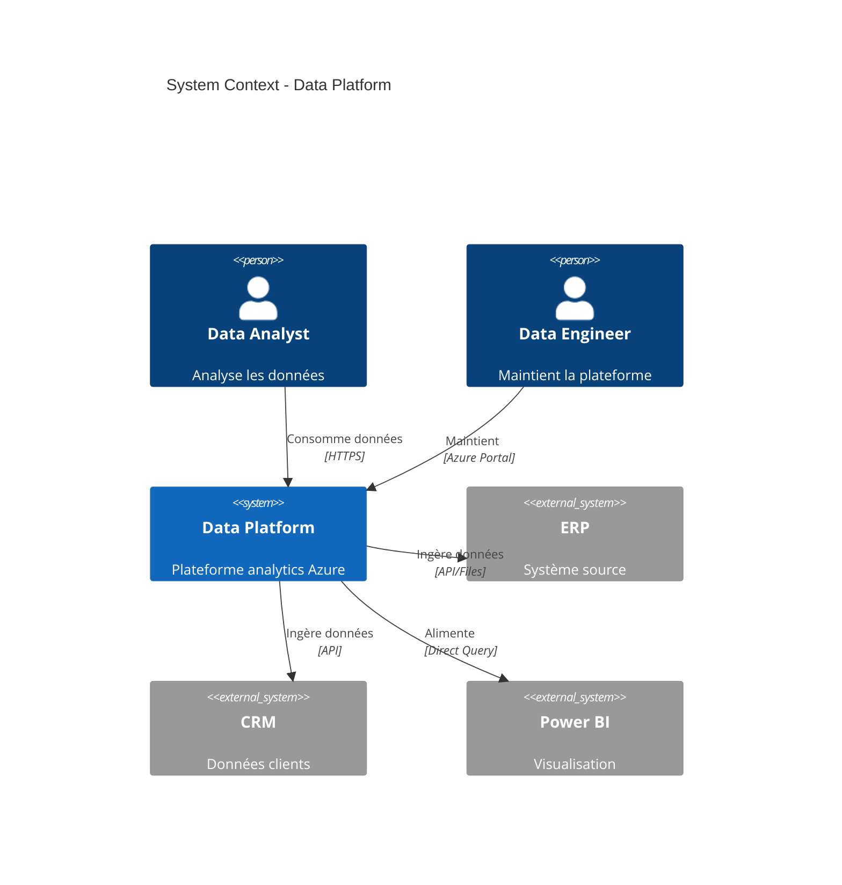
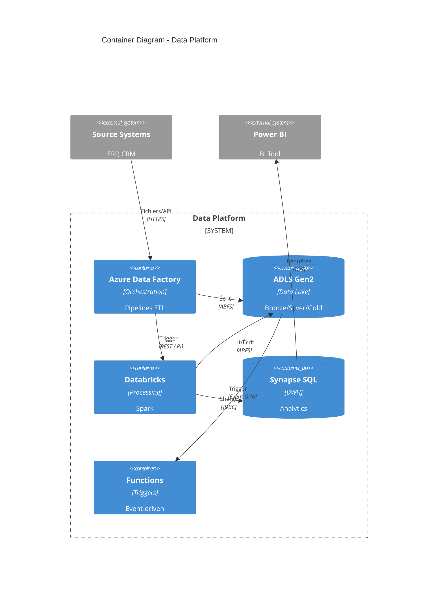
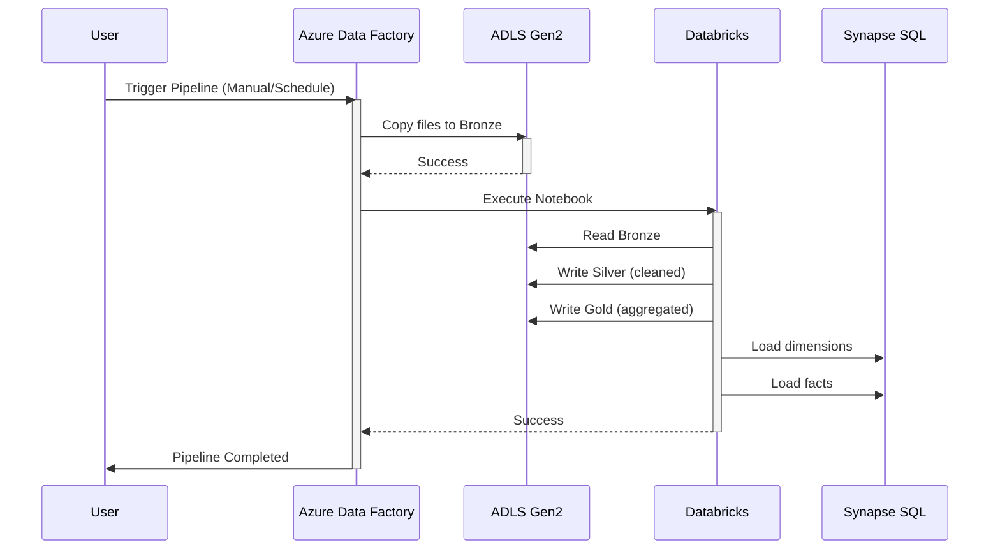
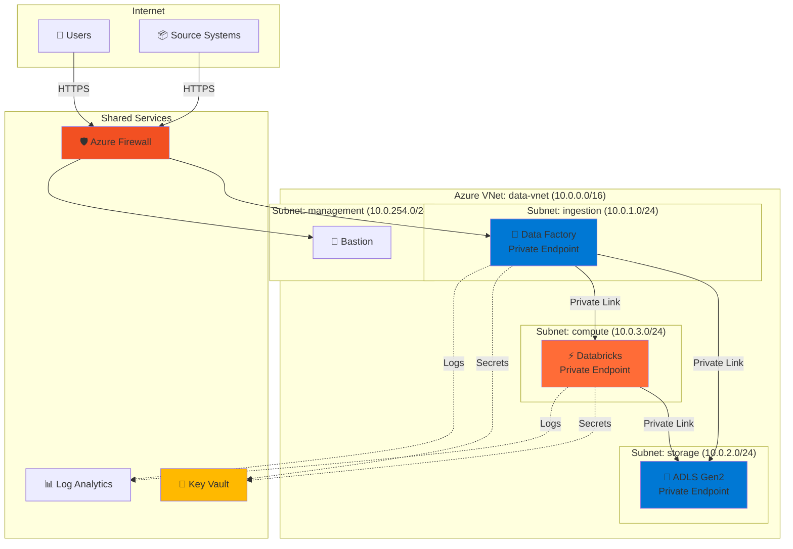
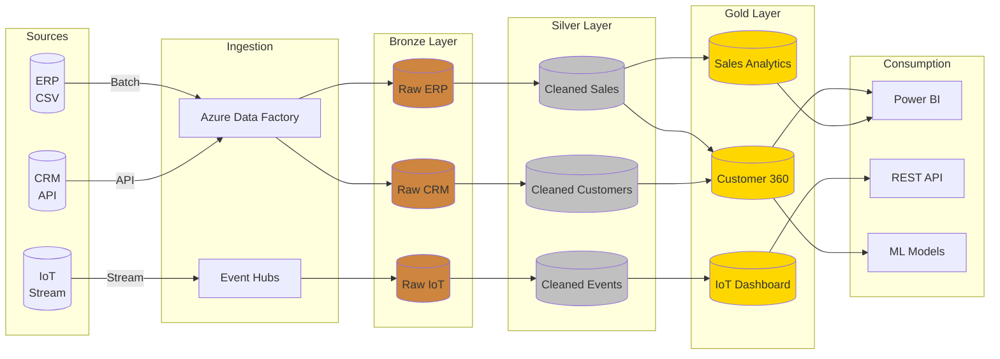

# Skill: Diagram Creation

## 🎯 Objectif

Créer des diagrammes d'architecture professionnels et clairs pour documenter et communiquer les solutions techniques.

## 📋 Types de Diagrammes

### 1. C4 Model

#### Level 1: Context Diagram
Montre le système dans son contexte avec acteurs et systèmes externes.

#### Level 2: Container Diagram
Détaille les conteneurs applicatifs principaux.

### 2. Sequence Diagram
Montre le flux d'exécution temporel.

### 3. Network Diagram
Architecture réseau et sécurité.

### 4. Data Flow Diagram
Flux de données end-to-end.

## 🛠️ Outils

### Mermaid (Intégré)
Pour diagrammes simples et rapides, directement dans Markdown.

### DrawIO / Diagrams.net
Pour architectures complexes nécessitant plus de personnalisation.

### PlantUML
Alternative pour diagrammes UML plus traditionnels.

## ✅ Bonnes Pratiques

1. **Clarté**: Un diagramme = Un objectif
2. **Légende**: Toujours expliquer les symboles
3. **Couleurs**: Utiliser pour grouper logiquement
4. **Niveaux**: Respecter les niveaux d'abstraction (C4)
5. **Mise à jour**: Maintenir synchronisé avec code
6. **Annotations**: Ajouter notes pour décisions importantes

## 📝 Templates

Voir `.github/prompts/diagram.prompt` pour templates réutilisables.

---

**Version**: 1.0.0  
**Type**: Skill  
**Agents**: @archi (principal), @ba (context), @dev (implementation)
