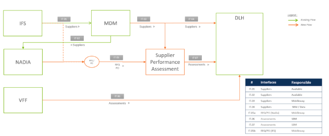
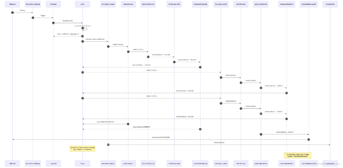
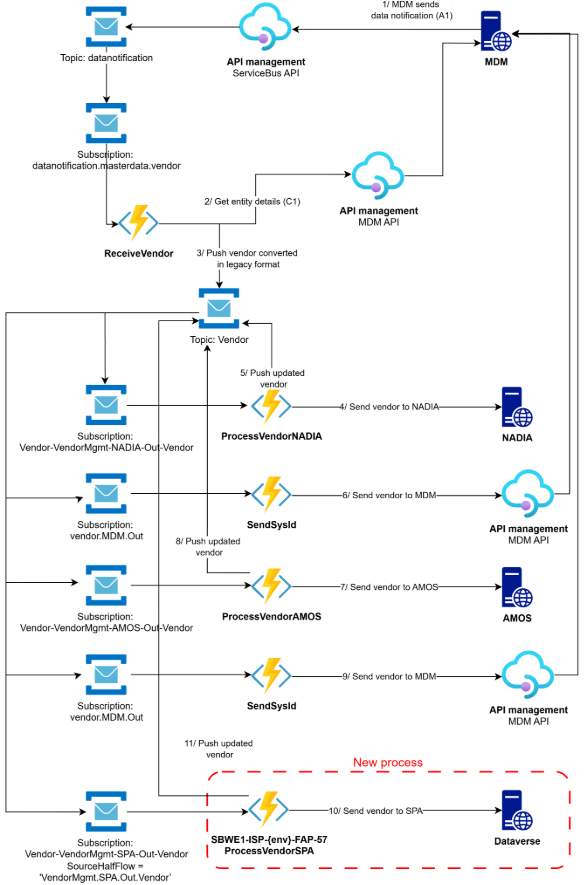
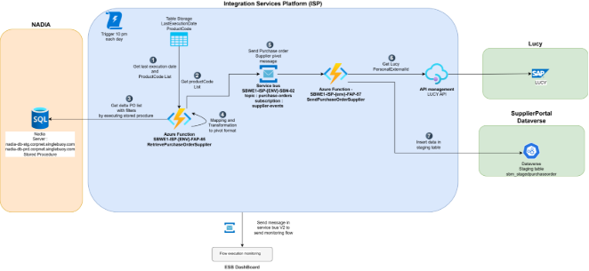
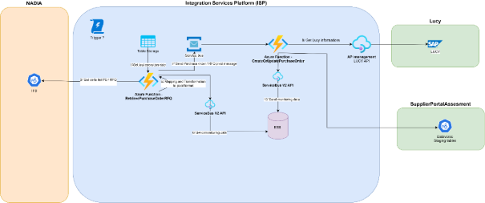



![Macintosh HD:Users:dissidentia-05:Desktop:Papier entête-21.png]

DOCUMENT IDENTIFICATION

|**Author(s):** |Aurélien LANDELLE|
| - | - |
|**Creation date:** |29/10/2025|
|**Reference:**|MW\_SBM\_SupplierPerformanceAssessment|
|**Version:** |1\.0|
|**Status:**|Initiate|
|**Customer contact(s):**|Virginie SOLER|

DOCUMENT HISTORY

|**Version**|**Date**|**Comment**|
| - | - | - |
|1\.0|29/10/2025|Document creation|

REFERENCED DOCUMENTS

|**Id**|**Name**|**Source**|**Version / Date**|
| - | - | - | - |
|1 |EBX Dataverse Field Mappings.xlsx| |` `26/11/2025|
|2|Mapping\_Nadia\_SPA\_V2.xlsx| |` `26/11/2025|

TABLE OF CONTENT

[**1.**	**CONTEXT	**3****](#_toc216876596)

[**2.**	**IT 03: MDM TO SUPPLIER PERFORMANCE ASSESSMENT	**3****](#_toc216876597)

[2.1.	Trigger mode	3](#_toc216876598)

[2.2.	List of the steps	3](#_toc216876599)

[2.3.	Global rules of flow	3](#_toc216876600)

[2.4.	Global behavior in case of error	3](#_toc216876601)

[2.5.	Technical Specification	4](#_toc216876602)

[**3.**	**IT 05A: NADIA TO SUPPLIER PERFORMANCE ASSESSMENT	**9****](#_toc216876603)

[3.1.	Trigger mode	10](#_toc216876604)

[3.2.	List of the steps	10](#_toc216876605)

[3.3.	Global rules of flow	10](#_toc216876606)

[3.4.	Global behavior in case of error	10](#_toc216876607)

[3.5.	Technical information	10](#_toc216876608)

[**4.**	**IT 05B: IFS TO SUPPLIER PERFORMANCE ASSESSMENT	**15****](#_toc216876609)

[4.1.	Trigger mode	15](#_toc216876610)

[4.2.	List of the steps	15](#_toc216876611)

[4.3.	Global rules of flow	15](#_toc216876612)

[4.4.	Global behavior in case of error	15](#_toc216876613)

[4.5.	Technical Specification	15](#_toc216876614)

1. # **Context**
This document stands for the technical specifications of Supplier Performance assessment flows. In the following sections, we describe flows part after part, including connectivity information (credentials, URLs, etc.), workflows, messages formats as well as monitoring milestones. 

This document describes the 3 following flows:

- IT 03: MDM to Supplier Performance Assessment
- IT 05a: NADIA to Supplier Performance Assessment
- IT 05b: IFS to Supplier Performance Assessment 

Supplier Performance Assessment is a tool where the suppliers can be assessed based on several kinds of data coming from other applications.

1. # **IT 03: MDM to Supplier Performance Assessment**
   1. ## Trigger mode
The flow is triggered by service bus message from MDM.
1. ## List of the steps
The main steps of the current flow are: 

- Retrieving information from MDM Pivot vendor Message
- Map this information to SPA data model
- Sending data into staging tables ‘sbm\_stagedsupplier’ and ‘sbm\_stagedcontact’

1. ## Global behavior in case of error

1. ## Technical Specification
` `This architecture is to be recreated in Azure. 
1. ### **Functional sequence diagram**

1. ### **Architecture** 

*Figure *1* MDM to Dataverse*

This new flow will be based on an existing flow that handles the transfer of supplier master data to the AMOS and NADIA systems.

This new flow will send vendor master data to the Supplier Performance Assessment (DataVerse) system. 

Master data collection for vendors is already in place. 

The data is transformed into a pivot format and transported via messages by the service bus.

To expose this data to Dataverse, we need to set up a new subscription

`  `The key steps in this workflow are as follows: 

- An Azure function ‘ReceiveVendor’ (SBWE1-ISP-{ENV}-FAP-41) will collect Data from MDM and build a message with pivot format dedicated to SPA.
- A subscription vendor.SPA.out with a simple sql filter ‘SourceHalfFlow = 'VendorMgmt.SPA.Out.Vendor’ will receive a message sent by the function ‘ReceiveVendor’. 
- The message uses the SPA pivot format. 
- An azure function ‘ProcessVendorSPA’ (SBWE1-ISP-{ENV}-FAP-57) is triggered by this message. 
- The message is deserialized, and a new mapping is performed to build the data

  on the expected model in the staging table on the DataVerse side.

- The data is sent to the staging table on the DataVerse side: 
  - sbm\_stagedsupplier (1)
  - sbm\_stagedcontact (n)

1. ### **Mapping rules**
Please look at mapping file: EBX Dataverse Field Mappings.xlsx
##
1. ### **Azure** 

**Resources**

Here are the Azure resources included in this project, for DEV environment. It is equivalent for other environments (STG, PROD). 

|Type |Name |Resource Group |Comment |
| - | - | - | - |
|Azure Function |SBWE1-ISP-DV-FAP-41|IntegrationServices-VEN-RG|Azure function to receive Vendor Master Data, convert into legacy pivot and sent message in service bus|
|Azure Function |SBWE1-ISP-DV-FAP-57|IntegrationServicesSTG-SPL-RG|Send vendor Master Data to DataVerse|
|Storage Account|
sbwe1ispdv{ven}sta01

|
IntegrationServicesDEV- VEN -RG

|To store function app runtime operations and data |
|Storage Account|sbwe1ispdvsuportal|IntegrationServicesDEV-SPL-RG|To store function app runtime operations and data |
|KeyVault |
SBWE1-ISP-DV-KVA-01 

|
IntegrationServicesDEV-CMN-RG 

|
Contains sensitive keys  

|
|Service Bus|
SBWE1-ISP-DV-SBN-02 

|IntegrationServicesDEV-CMN-RG |To send messages for flow in ESB Dashboard and logs.|
|Azure Function |SBWE1-ISP-DV-FAP-72|IntegrationServices-MON-RG|To send ESB Dashboard Request to Elastic Search API|

**Tags**

|Name |Value |
| - | - |
|Env |DEV/STG/PRD |
|Flow |SupplierPortal|
|Desc |SupplierPortal generic connector built as part of Supplier Portal project|

1. ### **Connectivity and security**

**MDM API:** 

URL: https://apimgt.sbmoffshore.com/mdm/graphql/vendor

Client Id: mdmClientId in release pipeline\
Client Secret: MDM-EBX-TOKEN-CLIENT-SECRET in Keyvault

Api Scope : api://masterdata-az-{env}.sbmoffshore.com/.default (STG / DEV)

` `- api://masterdata-az.sbmoffshore.com/.default (PRD)

API Subcription Key : Product MDM subscription linked to product MDMRework

**Dataverse API:** 

URL: 

Dev: https://sbmsupplierportaltest.crm4.dynamics.com/

` `Uat: https://sbmsupplierportaluat.crm4.dynamics.com/

Client Id: dataverseClientId in release pipeline\
Client Secret: SUPPLIER-PORTAL-DATAVERSE-CLIENT-SECRET in Keyvault

1. ### **Azure Devops** 
**Repository**

Vendor Repository will contain Half flow to received and send Master Data Vendordata in Service Bus and azure function SBWE1-ISP-DV-FAP-41.

Supplier Portal Repository will contain Half flow to receive message and send Master Data Vendor to SPA and azure function SBWE1-ISP-DV-FAP-57.

**Continuous Integration**

*Branching strategy*

![Une image contenant diagramme

Description générée automatiquement] 

The default branch is main. We always create new branches from main. Work in progress is done on feature branches, under the naming rule “feature/<**flow**>/x”. The more commits, the better. Once it can be deployed, we create release branches under the naming rule “release/<**flow**>/y”. For DEV environment, we can deploy directly from feature branches. On release branches, we keep the history of all commits from feature branches. One release branch can include one or more feature branches, in case we want to deploy several features at the same time. When the release is validated, it can be deployed to the production environment. Then we merge the release into the main branch with the “squash merge” option to keep a clean commit history for the main branch. 

*Continuous Delivery* 

` `There is one build pipeline per repository, and one project build pipeline that contains all resources used by more than one flow. The granularity is the same for release pipelines. For release pipelines, we have two root folders named Core - ADF – EDB and ElectricalCable. 

**Naming**: 

- Build pipeline per flow: Vendor SPA
- Project build pipeline: Vendor SPA
- Release pipeline per flow: Vendor - All
- Project release pipeline: Vendor - All
- Build pipeline per flow: Supplier Portal
- Project build pipeline: Supplier Portal
- Release pipeline per flow: SupplierPortal
- Project release pipeline: SupplierPortal
  1. ### **Monitoring** 
**ESB Dashboard**

Flow type : ??

1. # **IT 05a: Nadia to Supplier Performance Assessment**
   1. ## Trigger mode
This flow is triggered with a daily schedule
1. ## List of the steps
The main steps of the current flow are: 

- Retrieving some information from PO Header Metadata
- Map this information to SPA data model
- Sending this metadata in staging table in ‘Dataverse’

1. ## Global behavior in case of error

1. ## Technical information
` `This architecture is to be recreated in Azure. 
1. ### **Functional sequence diagram**
TBC
1. ### **Architecture** 

*Figure 2 Nadia to Dataverse*

This new flow will be in charge to transferred PO information from NADIA Database to Dataverse.

This new flow will send Information from PO data to the Supplier Performance Assessment (DataVerse) system. 

`  `The key steps in this workflow are as follows: 

- An Azure function ‘RetrivePurchoseOrderVendor’ (SBWE1-ISP-{ENV}-FAP-65) will collect Data by executing a stored procedure. This stored procedure use two parameters : 
  - LastExecutionDate as NVARCHAR
  - LastExecutionTime as NVARCHAR
- The date of last execution date is stored in table storage “LastExecutionDate” with ‘  for PartitionKey and timestamp for RowKey. 
- The data is retrieved and converted into SPA pivot format.
- For each data point, a message in sent in service bus topic “purchase-orders” in “ supplier-events”  for each PO supplier including all needed data as properties.
- The message uses the SPA pivot format. 
- An azure function ‘SendPurchaseOrderSupplier’ (SBWE1-ISP-{ENV}-FAP-57) is triggered by this message. 
- A call API (Get) is sent to Lucy API to get ‘PersonIdExternal’ from package manager.
- The message is deserialized, and a new mapping is performed to build the data on the expected model in the staging table on the DataVerse side.
- The data is sent to the staging table on the DataVerse side.
  - sbm\_stagedpurchaseorder

1. ### **Mapping rules**
Look at mapping file: Mapping\_Nadia\_SPA\_V2.xlsx
1. ### **Azure** 
**Resources** 

Here are the Azure resources included in this project, for DEV environment. It is equivalent for other environments (STG, PROD). 

|Type |Name |Resource Group |Comment |
| - | - | - | - |
|Azure Function|SBWE1-ISP-DV-FAP-65|IntegrationServices-VEN-RG|Azure function to receive Nadia PO Supplier Data|
|Azure Function |SBWE1-ISP-DV-FAP-57|IntegrationServicesSTG-SPL-RG|Send Supplier data to DataVerse|
|Storage Account|sbwe1ispdvnadia|
IntegrationServicesDEV- NDA -RG

|To store function app runtime operations and data |
|Storage Account|sbwe1ispdvsuportal|IntegrationServicesDEV-SPL-RG|To store function app runtime operations and data |
|KeyVault |
SBWE1-ISP-DV-KVA-01 

|
IntegrationServicesDEV-CMN-RG 

|
Contains sensitive keys  

|
|Service Bus|
SBWE1-ISP-DV-SBN-02 

|IntegrationServicesDEV-CMN-RG |To send messages for flow in ESB Dashboard and logs.|
|Azure Function |SBWE1-ISP-DV-FAP-72|IntegrationServices-MON-RG|To send ESB Dashboard Request to Elastic Search API|

**Tags** 

|Name |Value |
| - | - |
|Env |DEV/STG/PRD |
|Flow |` `Purchase Order to Supplier Portal|
|Desc |Purchase Order to Supplier Portal|

1. ### **Store procedure (SQL)** 
Please see the file attached named

1. ### **Connectivities and security**

**NADIA  SQL :** 

SQL Server:

- nadia-db-stg.corpnet.singlebuoy.com (DEV/ STG)
- nadia-db-prd.corpnet.singlebuoy.com (PRD)

Database: 

- NADIA

SQL Account: 

- SQL\_NADIA\_IFS\_AZURE\_STG (DEV / STG)
- SQL\_NADIA\_IFS\_AZURE (PRD)

Stored procedure: NADIA\_SPA\_SUPHEADERMETADATA\_AZURE

**Dataverse API:** 

URL: 

Dev: https://sbmsupplierportaltest.crm4.dynamics.com/

` `Uat: https://sbmsupplierportaluat.crm4.dynamics.com/

Client Id: dataverseClientId in release pipeline\
Client Secret: SUPPLIER-PORTAL-DATAVERSE-CLIENT-SECRET in Keyvault

1. ### **Azure Devops** 
**Repository**

Nadia Repository will contain Half flow to received and send Supplier header PO Metadata in Service Bus and azure function SBWE1-ISP-DV-FAP-65.

Supplier Portal Repository will contain Half flow to receive message and send Supplier header PO Metadata to SPA and azure function SBWE1-ISP-DV-FAP-57.

**Continuous Integration** 

*Branching strategy*

![Une image contenant diagramme

Description générée automatiquement] 

The default branch is main. We always create new branches from main. Work in progress is done on feature branches, under the naming rule “feature/<**flow**>/x”. The more commits, the better. Once it can be deployed, we create release branches under the naming rule “release/<**flow**>/y”. For DEV environment, we can deploy directly from feature branches. On release branches, we keep the history of all commits from feature branches. One release branch can include one or more feature branches, in case we want to deploy several features at the same time. When the release is validated, it can be deployed to the production environment. Then we merge the release into the main branch with the “squash merge” option to keep a clean commit history for the main branch. 

*Continuous Delivery* 

` `There is one build pipeline per repository, and one project build pipeline that contains all resources used by more than one flow. The granularity is the same for release pipelines. For release pipelines, we have two root folders named Core - ADF – EDB and ElectricalCable. 

**Naming**: 

- Build pipeline per flow: NADIA
- Project build pipeline: NADIA
- Release pipeline per flow: NADIA - PurchaseOrders
- Project release pipeline: NADIA - PurchaseOrders
- Build pipeline per flow: Supplier Portal
- Project build pipeline: Supplier Portal
- Release pipeline per flow: SupplierPortal
- Project release pipeline: SupplierPortal

  1. ### **Monitoring** 
**ESB Dashboard**

Flow type: ??

1. # **IT 05b: IFS to Supplier Performance Assessment**
   1. ## Trigger mode
Assumption: the flow must be triggered through http trigger from IFS. 

1. ## List of the steps
The main steps of the current flow are: 

  1. ## Global rules of flow
  1. ## Global behavior in case of error

1. ## Technical Specification
   1. ### **Functional sequence diagram**

1. ### **Architecture** 

1. ### **Mapping rules**
To be completed : Mapping between Message pivot and dataverse Staging table model. 
1. ### **Azure** 
**Resources**

Here are the Azure resources included in this project, for DEV environment. It is equivalent for other environments (STG, PROD). 

|Type |Name |Resource Group |Comment |
| - | - | - | - |
|Azure Function |SBWE1-ISP-DV-FAP-66|IntegrationServices-VEN-RG||
|Azure Function |SBWE1-ISP-DV-FAP-57|IntegrationServicesSTG-SPL-RG|Send vendor Master Data to DataVerse|
|KeyVault |
SBWE1-ISP-DV-KVA-01 

|
IntegrationServicesDEV-CMN-RG 

|
Contains sensitive keys  

|
|Service Bus|
SBWE1-ISP-DV-SBN-02 

|IntegrationServicesDEV-CMN-RG |To send messages for flow in ESB Dashboard and logs.|
|Azure Function |SBWE1-ISP-DV-FAP-72|IntegrationServices-MON-RG|To send ESB Dashboard Request to Elastic Search API|

**NB**: See detail in ID cards paragraph 

**Tags** 

|Name |Value |
| - | - |
|Env |DEV/STG/PRD |
|Flow |` `??|
|Desc |Send Vendor to DataVerse (Supplier Performance Assessement)|

**NB**: See detail in ID cards paragraph 

1. ### **Connectivities and security**

**IFS API:** 

URL: https://apimgt.sbmoffshore.com/compute/IFS

Api Scope: api://api.ifs.{env}/.default

API Subcription Key : Compute subscription Key link to Product Compute

**Dataverse API:** 

URL: 

Dev: https://sbmsupplierportaltest.crm4.dynamics.com/

` `Uat: <https://sbmsupplierportaluat.crm4.dynamics.com/>

Client Id: dataverseClientId in release pipeline\
Client Secret: SUPPLIER-PORTAL-DATAVERSE-CLIENT-SECRET in Keyvault

1. ### **Azure Devops** 
**Repository**

Vendor Repository will contain Half flow to received and send Master Data Vendordata in Service Bus and azure function SBWE1-ISP-DV-FAP-41.

Supplier Portal Repository will contain Half flow to receive message and send Master Data Vendor to SPA and azure function SBWE1-ISP-DV-FAP-57.

**Continuous Integration**

*Branching strategy*

![Une image contenant diagramme

Description générée automatiquement] 

The default branch is main. We always create new branches from main. Work in progress is done on feature branches, under the naming rule “feature/<**flow**>/x”. The more commits, the better. Once it can be deployed, we create release branches under the naming rule “release/<**flow**>/y”. For DEV environment, we can deploy directly from feature branches. On release branches, we keep the history of all commits from feature branches. One release branch can include one or more feature branches, in case we want to deploy several features at the same time. When the release is validated, it can be deployed to the production environment. Then we merge the release into the main branch with the “squash merge” option to keep a clean commit history for the main branch.

*Continuous Delivery*

` `There is one build pipeline per repository, and one project build pipeline that contains all resources used by more than one flow. The granularity is the same for release pipelines. For release pipelines, we have two root folders named Core - ADF – EDB and ElectricalCable. 

**Naming**: 

- Build pipeline per flow: IFS - PurchaseOrder
- Project build pipeline: IFS - PurchaseOrder
- Release pipeline per flow: IFS – PurchaseOrder
- Project release pipeline: IFS - PurchaseOrder
- Build pipeline per flow: Supplier Portal
- Project build pipeline: Supplier Portal
- Release pipeline per flow: SupplierPortal
- Project release pipeline: SupplierPortal

  1. ### **Monitoring** 
**ESB Dashboard**

Flow type : ??

**Interface identity card**

|PartnerCode |Type |Name |Resource Group |Comment |
| - | - | - | - | - |
||||||
||||||
||||||
||||||
||||||
||||||

18

[Macintosh HD:Users:dissidentia-05:Desktop:Papier entête-21.png]: Aspose.Words.c381d102-34db-4842-8bbf-14490914aec8.007.png
[Une image contenant diagramme

Description générée automatiquement]: Aspose.Words.c381d102-34db-4842-8bbf-14490914aec8.012.png
